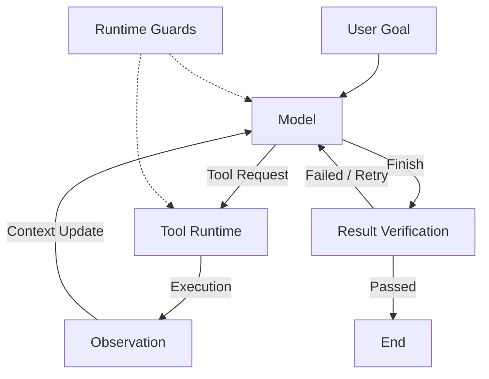

# Agent 与 LLM Workflow：架构边界、Agent Loop 及工具使用范式

> **关键词**：AI Agent、LLM Workflow、Agent Loop、ReAct、Toolformer

## 1. Agent 与 LLM Workflow 的本质区别

Agent 与 LLM Workflow 的核心区别不在于是否调用外部工具、是否包含多轮推理，而在于**系统执行过程的控制权（Control Flow）由谁主导**。

Anthropic 在 *Building Effective Agents* 中将两者区分为 [1]：

* **Workflow**：LLM 与工具沿开发者预先定义的代码路径执行，由程序编排整体控制流程。
* **Agent**：LLM 根据当前任务状态和环境反馈，动态决定执行过程、工具调用及后续行动。

需要注意，这是一种工程架构层面的分类，而非学术界对 Agent 的唯一形式化定义。

### 1.1 控制流与决策权

对于 Workflow，系统的整体执行拓扑通常在设计阶段确定。即使某些节点使用 LLM 进行分类、路由或生成，其可执行路径仍受预设编排逻辑约束。

对于 Agent，开发者主要定义任务目标、工具集合与执行边界，而具体行动序列由模型根据环境反馈动态生成。

| 比较维度 | LLM Workflow  | AI Agent       |
| ---- | ------------- | -------------- |
| 控制流  | 预定义编排逻辑       | 模型动态决策为主       |
| 决策范围 | 主要在预设节点内部     | 可动态选择行动及执行顺序   |
| 工具使用 | 可调用工具         | 可调用工具          |
| 环境反馈 | 按预设逻辑处理       | 可影响后续行动策略      |
| 可预测性 | 相对较高          | 相对较低           |
| 主要优势 | 可控性、稳定性、成本可预测 | 灵活性、适应性、复杂任务处理 |
| 主要挑战 | 灵活性受预设路径限制    | 成本、错误传播与安全控制   |

由此可以得到三个判断：

1. **Tool Calling ≠ Agent**：工具调用只是模型与外部环境交互的能力，并不决定系统是否具有自主控制权。
2. **Iteration ≠ Agent**：循环生成和评估同样可以通过预定义 Workflow 实现。
3. **Planning ≠ Agent**：预先生成计划并严格执行，与根据环境反馈持续修订计划，是不同的执行机制。

因此，Agent 与 Workflow 的边界并非完全二元化，而是与模型在整个系统中拥有的决策权限和自主程度有关。

## 2. Anthropic 的典型 Workflow 架构

Anthropic 总结了五种常见的 Workflow 模式 [1]：

| 模式                   | 核心机制                     | 适用场景      |
| -------------------- | ------------------------ | --------- |
| Prompt Chaining      | 将任务拆解为顺序执行的 LLM 调用       | 固定步骤的文本处理 |
| Routing              | 根据输入选择预设处理路径             | 请求分类、模型路由 |
| Parallelization      | 并行处理多个子任务并聚合结果           | 多维评估、并行分析 |
| Orchestrator–Workers | 中心 LLM 动态分解任务并分配给 Worker | 多子任务协作    |
| Evaluator–Optimizer  | 生成、评估和迭代优化               | 代码优化、文本改进 |

其中，Orchestrator–Workers 和 Evaluator–Optimizer 容易与 Agent 混淆。

Orchestrator–Workers 允许中心 LLM 动态生成子任务，但整体仍运行在预先定义的协调与执行框架内；Evaluator–Optimizer 虽然具有循环反馈机制，但生成、评估和重试的控制逻辑通常是固定的。

**局部决策的动态性不等于整个系统控制流的自主性。**

实际工程中，Workflow 与 Agent 可以组合使用。例如，由 Workflow 负责审批、验证和结果汇总，由 Agent 负责其中需要动态探索的任务。

## 3. Agent Loop：基于环境反馈的闭环决策

Agent 的核心运行机制可以抽象为一个持续与外部环境交互的闭环过程：

**Model → Tool → Observation → Model**

模型基于当前上下文选择动作，工具执行动作并返回观察结果，模型再根据更新后的上下文决定下一步行为。

### 3.1 Agent Loop 架构



核心组成包括：

* **Model**：生成下一步动作，可选择工具调用或任务终止。
* **Tool Runtime**：验证工具请求并执行实际操作。
* **Observation**：工具返回的信息，包括查询结果、环境变化或执行错误。
* **Context Update**：将新的动作与观察记录加入模型上下文。
* **Termination**：根据任务完成情况及外部约束终止循环。

需要区分模型决策与工具执行：**LLM 负责提出动作，实际工具操作由外部运行时执行。** 模型并不直接拥有执行任意操作的权限。

### 3.2 形式化描述

从序列决策的视角，可以将 Agent 抽象为一个基于历史信息选择动作的策略。

定义：

* \(g\)：用户给定的任务目标；
* \(h_t\)：时刻 \(t\) 的交互历史；
* \(\mathcal{T}\)：可用工具集合；
* \(\pi_\theta\)：由模型参数 \(\theta\) 决定的行动策略；
* \(a_t\)：时刻 \(t\) 选择的动作；
* \(o_{t+1}\)：动作执行后获得的观察结果。

模型的行动选择可表示为：

$$
a_t \sim \pi_\theta(\cdot \mid g,h_t,\mathcal{T})
$$

当 \(a_t\) 为工具调用时，运行时与环境交互：

$$
o_{t+1}=\operatorname{Execute}(a_t,s_t)
$$

其中 \(s_t\) 表示执行动作时的环境状态。

交互历史随之更新：

$$
h_{t+1}=h_t\oplus(a_t,o_{t+1})
$$

这里的 \(\oplus\) 表示将新的动作与观察信息加入历史上下文。

这一过程体现了 Agent 的核心特征：

**模型的后续动作不仅取决于初始任务，还取决于此前执行动作产生的实际反馈。**

因此，Agent 可以被视为一种基于部分环境观测进行闭环决策的系统，而不是一次性生成完整操作序列的静态执行器。

这一形式化描述是对通用 Agent Loop 的抽象，并不意味着所有 LLM Agent 都使用强化学习训练，也不意味着其内部一定显式维护完整的环境状态。

### 3.3 Agent Loop 的终止机制

实际 Agent 不能仅依赖模型主动宣布任务完成。

常见终止条件包括：

* **目标完成**：任务结果通过验证；
* **迭代限制**：达到最大执行轮次；
* **资源限制**：超出时间、Token 或费用预算；
* **权限限制**：操作需要人工授权；
* **不可恢复错误**：系统无法继续安全执行。

其中，停止条件和权限约束应由外部运行时强制执行，而不能仅作为 Prompt 中的建议。

同时，Observation 并不天然等于 Ground Truth。工具结果可能过期、不完整或受到恶意输入影响。对于关键任务，需要额外验证工具结果的真实性、完整性及执行后果。

## 4. ReAct：推理与行动的协同机制

Yao 等人在 ICLR 2023 提出了 ReAct（Reasoning and Acting），将语言推理与环境交互结合到同一任务执行过程中 [2]。

其核心思想是：

**Reasoning 引导 Action，Action 获得的 Observation 又反过来修正 Reasoning。**

### 4.1 ReAct 与传统推理范式

传统 Chain-of-Thought（CoT）主要通过语言推理完成任务，但缺乏执行过程中的外部环境交互，可能出现事实幻觉与推理错误累积。

单纯的 Act-only 方法虽然允许模型与环境交互，但缺少显式的高层推理来辅助任务分解、状态跟踪和异常处理。

ReAct 将二者结合：

```text
Thought      → 更新任务理解与行动计划
Action       → 调用工具或执行环境动作
Observation  → 获取环境反馈
Thought      → 根据反馈修订后续行动
...
```

这使模型能够在执行过程中持续调整计划，而不是完全依赖初始推理。

### 4.2 ReAct 的形式化思想

ReAct 将传统环境动作空间 \(\mathcal{A}\) 扩展为：

$$
\hat{\mathcal{A}}=\mathcal{A}\cup\mathcal{L}
$$

其中：

* \(\mathcal{A}\) 表示实际影响或查询环境的动作空间；
* \(\mathcal{L}\) 表示语言形式的推理动作空间。

语言推理动作不直接改变外部环境，而是更新模型用于后续决策的上下文。

这种设计使推理与执行能够交替进行。

值得注意的是，ReAct 并不要求所有任务都严格按照相同的 Thought–Action 比例执行。在知识密集型问答中，推理与行动通常密集交替；而在交互式决策任务中，推理可以只出现在需要规划或修订策略的关键位置。

ReAct 本质上是一种推理与行动协同的任务执行范式，而不是所有 Agent 系统必须采用的唯一架构。现代 Agent 也不必向用户公开完整的内部推理过程；可记录的工具调用、状态变化和决策摘要通常更适合作为工程审计信息。

## 5. Toolformer：工具使用能力的自监督学习

Schick 等人在 NeurIPS 2023 提出 Toolformer，研究如何让语言模型通过训练自主学习外部 API 的使用方式 [3]。

其关注点与 ReAct 不同：

* ReAct 主要研究推理和环境行动如何在执行过程中交替协同；
* Toolformer 主要研究模型如何通过学习获得工具调用能力。

### 5.1 Toolformer 的训练机制

Toolformer 的核心流程包括：

1. **API Call Sampling**：在文本中的候选位置采样可能的工具调用。
2. **API Execution**：实际执行候选调用，获取工具结果。
3. **API Call Filtering**：依据工具结果是否改善后续 Token 预测进行筛选。
4. **Model Fine-tuning**：使用插入了有效工具调用及其结果的数据微调模型。

其关键思想是：并非所有工具调用都有价值，只有能够带来有效信息增益的调用才值得保留。

具体而言，Toolformer 根据工具结果对语言模型预测损失的改善程度筛选训练样本：

$$
\Delta L_i=L_i^{-}-L_i^{+}
$$

其中：

* \(L_i^{+}\)：提供工具调用及返回结果时的加权预测损失；
* \(L_i^{-}\)：不调用工具与仅提供工具调用、不提供结果两种情况下的预测损失的较小值。

当满足：

$$
\Delta L_i\geq\tau_f
$$

候选工具调用才被保留用于构建训练数据。

这一机制使模型能够通过自监督信号学习何时调用工具、如何构造参数，以及如何利用工具返回结果。

需要强调：**降低 Token 预测损失不等价于直接优化任务成功率。** 它是 Toolformer 用来筛选有效工具调用的训练信号。

### 5.2 ReAct 与 Toolformer 的关系

| 维度          | ReAct          | Toolformer        |
| ----------- | -------------- | ----------------- |
| 主要问题        | 如何协同推理与环境行动    | 如何学习工具使用能力        |
| 核心机制        | 推理、行动、观察交替执行   | 自监督数据构造与微调        |
| 研究侧重        | 执行时的交互决策       | 工具调用能力的训练         |
| 工具作用        | 获取反馈并修订决策      | 提供改善预测的信息         |
| 与 Agent 的关系 | 典型的 Agent 执行范式 | 可为 Agent 提供工具使用能力 |

两者并不互斥。

从系统层面看，Toolformer 研究的工具使用能力可以成为 Agent 行动策略的一部分，而 ReAct 提供了组织推理与外部交互的一种方式。

## 6. Agent 的任务适用性与工程权衡

并不是所有多步骤任务都适合采用 Agent。

是否需要 Agent，应主要考虑任务路径的不确定性、环境反馈的价值、可验证性，以及自主决策引入的成本和风险。

### 6.1 适合 Agent 的任务

**任务一：自动化代码缺陷修复**

执行过程可能包括：

```text
运行测试 → 定位错误 → 阅读源码
→ 修改代码 → 重新测试 → 继续修复或结束
```

其适用原因在于：错误位置、修复步骤和执行次数难以提前确定，需要持续根据测试反馈调整策略。

同时，测试结果可以作为部分可验证的成功信号。

**任务二：复杂技术问题的根因调查**

例如分析软件依赖升级后产生的兼容性问题。

Agent 需要根据调查结果动态决定下一步操作，包括查阅版本文档、检查依赖关系、定位异常代码和执行复现测试。

这类任务的搜索空间不固定，环境反馈对后续决策具有直接影响。

### 6.2 不适合 Agent 的任务

**任务一：结构化数据的确定性统计**

例如对数据库中符合条件的订单金额求和。

执行路径明确，直接使用 SQL 或普通程序即可完成。引入 Agent 不仅没有必要，还会增加延迟与计算成本。

**任务二：固定流程的文章摘要与信息抽取**

例如：

```text
读取文章 → 生成摘要 → 提取关键词 → 输出 JSON
```

如果输出结构、步骤及处理规则已经确定，单次 LLM 调用或简单 Workflow 通常更合适。

### 6.3 工程评价与约束

Agent 的自主性并不天然带来性能提升。

相比固定 Workflow，Agent 可能引入更高的执行成本、更长的响应时间，以及多步骤错误累积。

因此，Agent 系统至少需要关注以下指标：

| 评价维度  | 关注指标                  |
| ----- | --------------------- |
| 任务有效性 | 任务成功率、结果正确性           |
| 执行效率  | Token 消耗、工具调用次数、端到端延迟 |
| 稳定性   | 重试次数、失败恢复能力           |
| 安全性   | 越权操作、危险工具调用、提示注入风险    |
| 可验证性  | 测试覆盖率、证据完整性、结果可复现性    |

对于相同任务，应尽可能在一致的工具条件与资源预算下比较 Agent、Workflow 和单次 LLM 调用等基线方案，而不是仅根据任务执行过程是否复杂判断系统优劣。

特别是在具有外部副作用的任务中，Agent 还需要明确的权限边界、沙盒隔离、人工审批与执行审计。

## 7. 总结

从架构角度看，Agent 与 LLM Workflow 的关键区别在于控制流的归属，而不是是否使用工具、规划或循环。

从执行机制看，Agent Loop 构成了模型与环境持续交互的闭环，使模型能够基于外部反馈动态调整行动。

从研究角度看，ReAct 关注推理与行动的协同，Toolformer 关注工具使用能力的学习，两者分别解释了 Agent 系统在运行机制和模型能力上的重要基础。

最终，Agent 应当被视为一种具有特定成本与风险的系统架构选择，而非默认优于 Workflow 的实现方式。

**Agent 系统设计的核心不是最大化自主性，而是在任务适应性、执行可靠性、成本与控制权之间取得合理平衡。**

---

## 参考文献

[1] Anthropic. (2024). *Building Effective Agents*. Anthropic Engineering.
https://www.anthropic.com/engineering/building-effective-agents

[2] Yao, S., Zhao, J., Yu, D., Du, N., Shafran, I., Narasimhan, K., & Cao, Y. (2023). *ReAct: Synergizing Reasoning and Acting in Language Models*. International Conference on Learning Representations (ICLR 2023).
https://arxiv.org/abs/2210.03629

[3] Schick, T., Dwivedi-Yu, J., Dessì, R., et al. (2023). *Toolformer: Language Models Can Teach Themselves to Use Tools*. Advances in Neural Information Processing Systems 36 (NeurIPS 2023).
https://proceedings.neurips.cc/paper_files/paper/2023/hash/d842425e4bf79ba039352da0f658a906-Abstract-Conference.html
