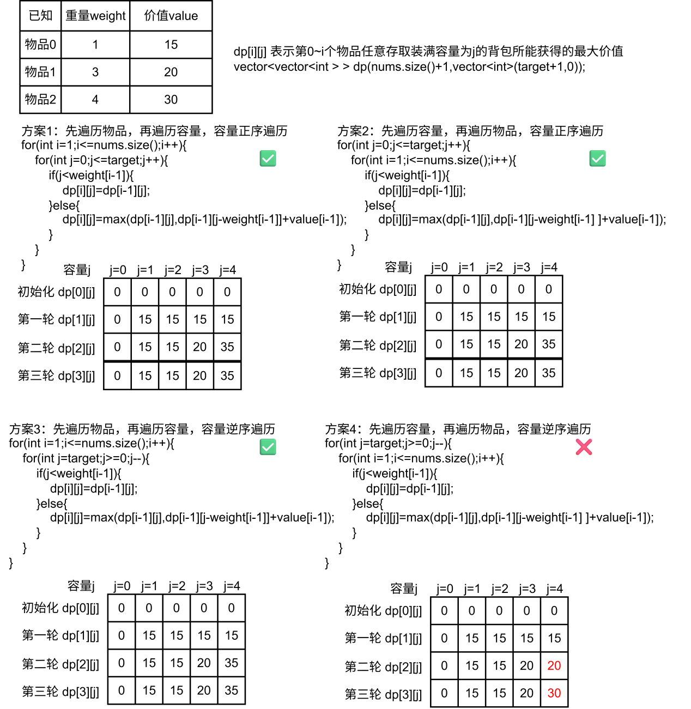
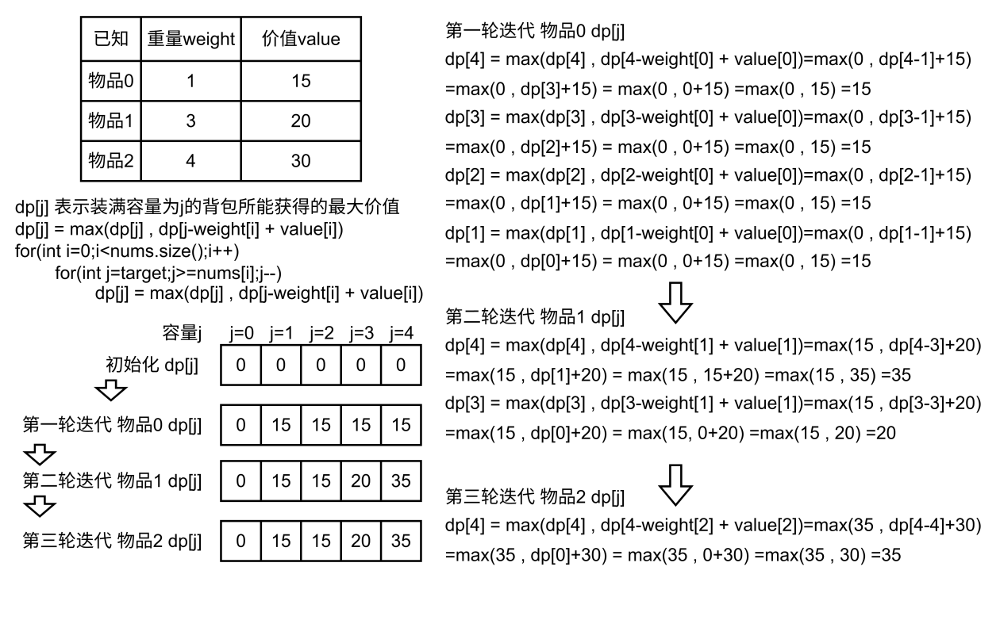
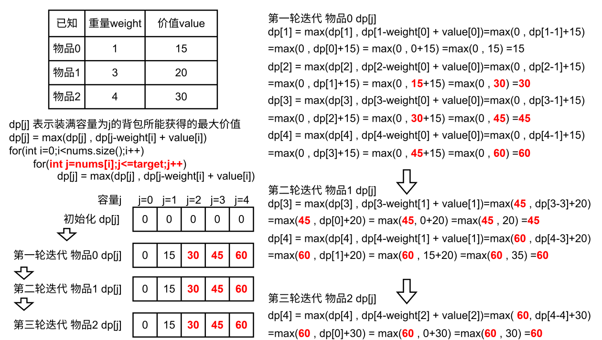
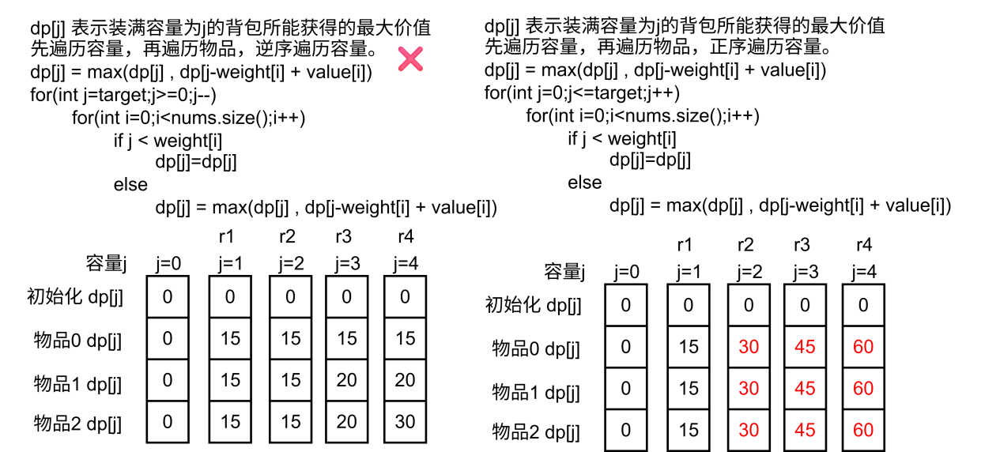

# 数据结构与算法

## 完整文档
C++ 与数据结构学习笔记。这里主要以word形式做的笔记，转md格式会出现混乱，所以这里转pdf进行展示。**点击如下链接，展开pdf全部内容**。

- [C++ 知识总结](./cpp-summary)

## 背包问题可视化过程

### 讨论交换物品和容量遍历顺序，讨论交换容量正反遍历顺序

### 先遍历物品，再反向遍历容量，模拟一轮背包问题的数据变化

由于是1维动态数组，容量更新从后往前更新，所以每次更新的时候是基于上一轮次物品的状态更新的，依据递推公式，不会存在增益叠加，每个物品至多被选择一次，所以这种遍历方式是“01背包”。

### 先遍历物品，再正向遍历容量，模拟一轮背包问题的数据变化

由于是1维动态数组，容量更新从前往后更新，所以每次更新的时候是基于本轮次物品的状态更新的，依据递推公式，会存在增益叠加，如果一个物品会带来多次增益，可能会被多次选中，所以这种遍历方式是“完全背包”。

### 先遍历容量，再正向/反向遍历容量，模拟一轮数据变化

