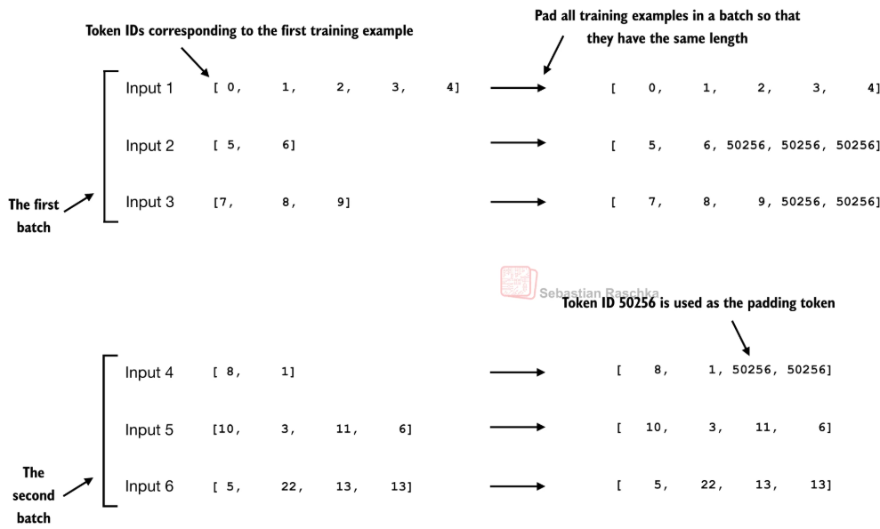
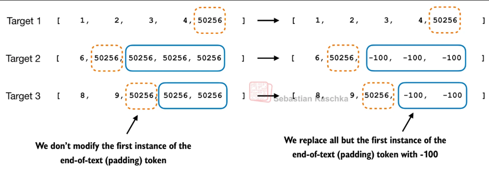
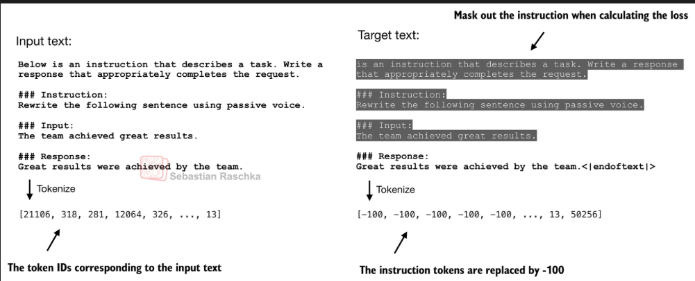
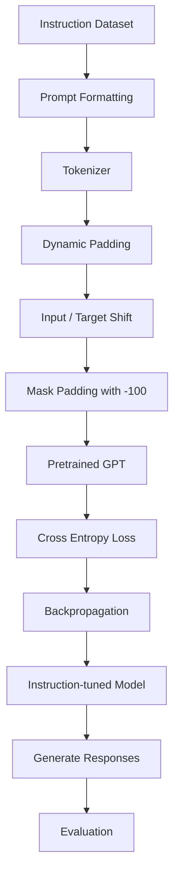
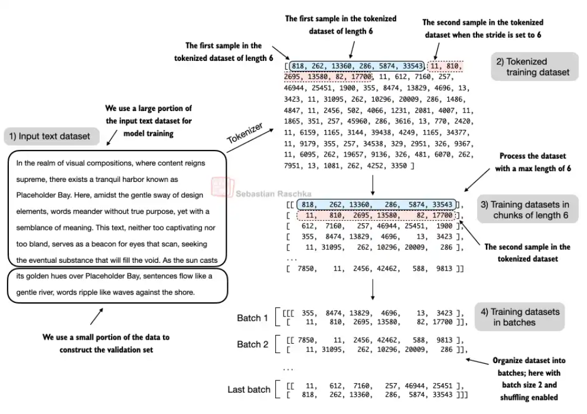

# 从“会续写”到“会听指令”：LLM 指令微调（SFT）完整理解——《LLMs from Scratch》第 7 章学习笔记

> 本文是我学习 Sebastian Raschka《Build a Large Language Model (From Scratch)》第 7 章 **Finetuning to Follow Instructions** 时整理的学习笔记。
>
> 这一章最重要的并不是记住某几个 PyTorch API，而是理解一个问题：
>
> **一个只会“预测下一个 Token”的语言模型，究竟是如何被训练成一个能够理解并执行人类指令的 Assistant 的？**

---
# 速览

掌握监督微调的数据构造方式，包括batch构造，padding操作，padding操作除了token末尾的padding token保留以外，其他的设置为-100，利用pytorch CrossEntropy的ingore_index=-100机制，不对-100的token计算交叉熵。掌握交叉熵的计算原理。

TODO 下一次复习的时候，把内容删减一些。






## 1. 先把整个 LLM 训练流程串起来


在学习指令微调之前，最好先从全局视角理解现代 LLM 的训练流程。

一个典型的大语言模型大致会经历：

```text
海量无标注文本
      ↓
Pretraining
预训练：学习语言和世界知识
      ↓
Base Model
基础模型：很会“续写”
      ↓
Supervised Fine-Tuning
监督式指令微调（SFT）
      ↓
Instruction Model
能够理解并执行指令
      ↓
Preference Alignment
RLHF / DPO / 其他偏好优化
      ↓
Chat / Assistant Model
更加符合人类偏好的模型
```

《LLMs from Scratch》第 7 章主要研究的，就是中间这一段：

```text
Base Model
    ↓
Instruction Fine-Tuning
    ↓
Instruction Model
```

这一步通常也被称为：

**Supervised Fine-Tuning，SFT，监督微调。**

---

# 2. 为什么预训练好的 LLM 还需要指令微调？

这是理解这一章最重要的问题。

假设我们已经在几十亿、几百亿甚至更多 Token 上预训练了一个语言模型。

它不是已经学到了大量知识吗？

为什么还需要微调？

原因在于：

> **“知道很多东西”和“知道用户希望自己做什么”，其实是两件不同的事情。**

---

## 2.1 预训练阶段，模型到底在学习什么？

GPT 类模型的训练目标其实非常简单：

> 根据前面的 Token，预测下一个 Token。

假设文本为：

```text
The capital of France is Paris.
```

经过 Tokenizer 后得到：

```text
x1, x2, x3, x4, x5, x6
```

训练过程实际上类似：

```text
输入                    目标
------------------------------------------------
The                     capital
The capital             of
The capital of          France
The capital of France   is
...
```

数学上，就是最大化：

$$
P(x_t | x_1, x_2, ..., x_{t-1})
$$

对应的训练 Loss 可以写成：

$$
\mathcal{L}
=
-\sum_{t=1}^{T}
\log
P(x_t|x_{<t})
$$

因此，预训练模型真正擅长的是：

```text
给我一段文本
      ↓
猜接下来最可能出现什么
```

也就是 **Text Completion**。

---

## 2.2 “文本续写”并不等价于“执行指令”

比如我们问一个 Base Model：

```text
Convert the active sentence to passive:

"The chef cooks the meal every day."
```

我们希望得到：

```text
The meal is cooked every day by the chef.
```

但 Base Model 可能生成：

```text
The chef cooks the meal every day.

Convert the following sentence...
```

甚至开始自己构造新的训练样本。

这并不是因为模型“不知道英语语法”。

而是因为：

> **模型根本不知道你希望它“回答问题”，它只知道要继续预测文本。**

事实上，在我运行这一章 notebook 时，微调前的 GPT-2 Medium 面对：

```text
Convert the active sentence to passive:
'The chef cooks the meal every day.'
```

生成的是：

```text
The chef cooks the meal every day.

### Instruction:

Convert the active sentence to passive: 'The chef cooks the ...
```

它明显把当前输入理解成了某种“训练数据格式”，然后继续续写下一条数据。

所以这里有一个非常重要的认知：

> **预训练主要让模型获得能力（Capability），而指令微调主要教模型如何使用这些能力。**

InstructGPT 的研究也展示了类似现象：单纯扩大语言模型规模，并不会自动保证模型更加符合用户意图；监督示范数据和后续偏好优化可以显著改变模型的交互行为。[2]

---

# 3. 什么是 Instruction Fine-Tuning？

Instruction Fine-Tuning 本质上并没有改变 GPT 的基本训练目标。

它仍然是：

```text
输入前面的 Token
      ↓
预测下一个 Token
```

真正发生变化的是：

**训练数据变了。**

预训练阶段的数据可能是：

```text
Artificial intelligence is a field of computer science that...
```

Instruction Fine-Tuning 阶段的数据则变成：

```text
Instruction:
Explain what artificial intelligence is.

Response:
Artificial intelligence is a field of computer science that...
```

于是模型逐渐学习到一种新的模式：

```text
看到 Instruction
       ↓
理解任务
       ↓
生成符合要求的 Response
```

所以可以把 SFT 理解为：

> **通过大量“指令 → 标准回答”的示范，告诉模型：以后遇到类似输入，你应该这样回答。**

---

# 4. SFT 的本质仍然是 Next Token Prediction

这一点非常重要，也是面试中很容易被问到的问题。

很多人第一次看到 Instruction Fine-Tuning 会以为需要设计一种新的 Loss。

其实通常并不需要。

比如训练样本：

```text
### Instruction:
Translate the following sentence into Chinese.

### Input:
I love machine learning.

### Response:
我喜欢机器学习。
```

最终会被 Tokenizer 转换成：

```text
[x1, x2, x3, ..., xn]
```

模型输入：

```text
[x1, x2, x3, ..., x(n-1)]
```

训练目标：

```text
[x2, x3, x4, ..., xn]
```

也就是整体向右移动一个 Token：

```text
Input:
A B C D E

Target:
B C D E F
```

因此：

> **SFT 从优化目标上看依然是 Causal Language Modeling，只不过训练数据从普通文本换成了高质量的 instruction-response 数据。**

这也是为什么预训练阶段实现的很多代码，可以直接复用到 SFT。

---

# 5. 构造 Instruction Dataset

这一章使用的数据格式非常经典：

```json
{
    "instruction": "Rewrite the sentence using a simile.",
    "input": "The car is very fast.",
    "output": "The car is as fast as lightning."
}
```

三个字段分别代表：

| 字段            | 含义                |
| ------------- | ----------------- |
| `instruction` | 模型需要执行什么任务        |
| `input`       | 完成任务所需要的额外信息，可以为空 |
| `output`      | 希望模型生成的标准答案       |

例如：

```json
{
    "instruction": "What is the capital of France?",
    "input": "",
    "output": "Paris."
}
```

此时因为问题本身已经包含所有信息，所以 `input` 可以为空。

在这一章中，总共有 **1100 条数据**，最终按照：

```text
Train      85%   → 935
Validation  5%   → 55
Test       10%   → 110
```

进行划分。

---

# 6. 为什么需要 Prompt Template？

原始 JSON 并不能直接代表我们最终希望模型看到的文本。

因此还需要把：

```json
{
    "instruction": "...",
    "input": "...",
    "output": "..."
}
```

转换成统一的 Prompt。

这一章使用的是经典的 **Alpaca-style Prompt Template**：

```text
Below is an instruction that describes a task.
Write a response that appropriately completes the request.

### Instruction:
{instruction}

### Input:
{input}

### Response:
{output}
```

如果没有 `input`：

```text
Below is an instruction that describes a task.
Write a response that appropriately completes the request.

### Instruction:
{instruction}

### Response:
{output}
```

代码实际上非常简单：

```python
def format_input(entry):
    instruction_text = (
        "Below is an instruction that describes a task. "
        "Write a response that appropriately completes the request."
        f"\n\n### Instruction:\n{entry['instruction']}"
    )

    input_text = (
        f"\n\n### Input:\n{entry['input']}"
        if entry["input"]
        else ""
    )

    return instruction_text + input_text
```

最终 Response 再拼接到后面：

```python
response_text = f"\n\n### Response:\n{entry['output']}"

full_text = format_input(entry) + response_text
```

---

# 7. Prompt Template 真的重要吗？

非常重要。

因为从模型的角度来看：

```text
### Instruction:
```

和：

```text
### Response:
```

并不是什么具有特殊语义的“程序指令”。

它们最开始也只是普通 Token。

真正让它们获得语义的是训练数据。

模型经过大量类似数据训练之后，会逐渐学习：

```text
### Instruction:
后面是用户要求

### Input:
后面是补充信息

### Response:
后面应该开始输出答案
```

所以：

> **Prompt Template 本身就是模型训练协议的一部分。**

这也是为什么现在使用 Llama、Qwen、Gemma 等 Chat Model 时，不能随便自己拼：

```text
User: xxx
Assistant:
```

现代 Chat Model 通常有自己训练时使用的 **Chat Template** 和角色 Token。

如果训练阶段使用：

```text
<|user|>
...
<|assistant|>
...
```

而推理阶段突然换成完全不同的格式，模型效果就可能下降。

因此实际项目里应该优先使用模型官方提供的 Chat Template。

可以把它理解成：

> **Prompt Template 就像模型的“通信协议”。**

---

# 8. Dataset 类：为什么提前 Tokenize？

书中的 `InstructionDataset` 大致如下：

```python
class InstructionDataset(Dataset):
    def __init__(self, data, tokenizer):
        self.data = data

        self.encoded_texts = []

        for entry in data:
            instruction_plus_input = format_input(entry)

            response_text = (
                f"\n\n### Response:\n{entry['output']}"
            )

            full_text = (
                instruction_plus_input
                + response_text
            )

            self.encoded_texts.append(
                tokenizer.encode(full_text)
            )

    def __getitem__(self, index):
        return self.encoded_texts[index]

    def __len__(self):
        return len(self.data)
```

这里有一个小细节：

```python
self.encoded_texts
```

在 Dataset 初始化的时候，就把所有文本 tokenize 好了。

于是训练过程中：

```text
读取样本
   ↓
直接拿 Token IDs
```

而不需要：

```text
读取文本
   ↓
Tokenizer
   ↓
Token IDs
```

反复进行。

对于这个只有 1100 条数据的小数据集，这么处理很方便。

但如果是几千万甚至更大规模的数据，通常就需要更加完整的数据流水线，而不是全部提前放入内存。

---

# 9. SFT 中非常关键的问题：Padding

接下来进入这一章我认为最值得认真理解的部分：

**如何把长度不同的 Instruction 数据放进同一个 Batch？**

假设三个样本经过 Tokenizer 后长度分别是：

```text
Sample 1:  50 tokens
Sample 2:  80 tokens
Sample 3: 120 tokens
```

神经网络通常希望一个 Batch 是规则的 Tensor：

```text
[batch_size, sequence_length]
```

不能直接构造：

```text
[3, ???]
```

所以必须 Padding。

---

# 10. Dynamic Padding：只 Padding 到当前 Batch 最长长度

一种简单方法是：

所有样本都 Padding 到模型最大长度：

```text
1024 tokens
```

但如果当前数据平均只有 70 Token：

```text
真实数据：  70
Padding：  954
```

绝大多数计算都浪费掉了。

所以这一章使用的是：

**Batch-level Dynamic Padding。**

例如：

```text
Sample 1: [1, 2, 3, 4, 5]
Sample 2: [6, 7]
Sample 3: [8, 9, 10]
```

当前最长长度为 5。

Padding 后：

```text
Sample 1: [1, 2, 3, 4, 5]
Sample 2: [6, 7, P, P, P]
Sample 3: [8, 9, 10, P, P]
```

于是同一个 Batch 内长度一致：

```text
[batch_size, max_length_of_this_batch]
```

但不同 Batch 可以拥有不同长度。

这也是为什么 notebook 中训练 DataLoader 会出现：

```text
torch.Size([8, 61])
torch.Size([8, 76])
torch.Size([8, 73])
torch.Size([8, 68])
...
```

Batch Size 始终为 8，但 Sequence Length 不断变化。

这会比全部 Padding 到 1024 节省大量无效计算。

---

# 11. 为什么使用 `<|endoftext|>` 作为 Padding Token？

GPT-2 本身没有专门设计传统意义上的 `<pad>` Token。

这一章于是使用：

```text
<|endoftext|>
```

它对应 GPT-2 Token ID：

```text
50256
```

作为 Padding Token。

所以：

```text
[32, 54, 18]
```

可能被 Padding 成：

```text
[32, 54, 18, 50256, 50256]
```

但是马上会产生一个问题：

> 模型是不是会被训练成不停预测 Padding？

这就需要引出下一部分。

---

# 12. 为什么 Target 需要 Shift One Position？

GPT 的任务永远是：

> 根据当前位置之前的 Token，预测下一个 Token。

例如：

```text
tokens = [10, 20, 30, 40, 50]
```

应该构造成：

```text
input:
[10, 20, 30, 40]

target:
[20, 30, 40, 50]
```

也就是：

```python
inputs = padded[:-1]
targets = padded[1:]
```

可以画成：

```text
Input   : A  B  C  D
            ↓  ↓  ↓  ↓
Target  : B  C  D  E
```

这个操作有时候叫：

**Next-token shift**。

---

# 13. `-100`：一个很不起眼但极其重要的数字

假设 Padding 后：

```text
targets =
[
    100,
    200,
    300,
    50256,
    50256,
    50256
]
```

如果直接计算 Cross Entropy：

```text
Loss =
Loss(100)
+ Loss(200)
+ Loss(300)
+ Loss(50256)
+ Loss(50256)
+ Loss(50256)
```

那么模型将花大量精力学习：

```text
预测 Padding
预测 Padding
预测 Padding
```

这当然没有意义。

因此我们希望：

```text
真实 Token → 算 Loss
Padding    → 不算 Loss
```

PyTorch 的 `CrossEntropyLoss` 默认提供：

```python
ignore_index = -100
```

Target 等于 `-100` 的位置不会参与 Loss 以及对应梯度计算。

因此可以把：

```text
50256 50256 50256
```

修改成：

```text
50256 -100 -100
```

最终变成：

```text
Target:
[
    100,
    200,
    300,
    50256,
    -100,
    -100
]
```

---

# 14. 为什么第一个 `<|endoftext|>` 不替换成 `-100`？

这是这段代码中非常容易忽略的地方。

书中的代码并不是：

```python
targets[targets == pad_token_id] = -100
```

而是：

```python
mask = targets == pad_token_id
indices = torch.nonzero(mask).squeeze()

if indices.numel() > 1:
    targets[indices[1:]] = -100
```

也就是说：

> **第一个 `<|endoftext|>` 保留下来，其余 Padding 才设置成 `-100`。**

为什么？

因为第一个：

```text
<|endoftext|>
```

实际上承担着：

**EOS，End Of Sequence**

的作用。

我们希望模型学习：

```text
回答已经结束
    ↓
应该生成 EOS
```

因此这一位置需要参与训练。

而后面的：

```text
<|endoftext|>
<|endoftext|>
<|endoftext|>
```

只是为了对齐 Tensor 长度，没有实际语义。

所以：

```text
第一个 EOS
→ 有意义
→ 计算 Loss

后面的 Padding
→ 无意义
→ ignore_index = -100
```

这是一个非常漂亮的数据处理细节。

---

# 15. `-100` 为什么真的能够忽略 Loss？

假设有三个训练目标：

```python
targets = [0, 1, 1]
```

Cross Entropy 会同时计算三个位置。

如果改成：

```python
targets = [0, 1, -100]
```

因为：

```python
ignore_index = -100
```

第三个位置就不会贡献 Loss。

可以理解为：

$$
L
=
\frac{
\sum_{t \in \mathcal{V}} L_t
}{
|\mathcal{V}|
}
$$

其中：

$$
\mathcal{V}
=
\{t \mid y_t \neq -100\}
$$

也就是只对 **有效 Token** 计算 Loss。

这个思想以后会频繁出现。

不仅 Padding 可以 Mask：

```text
Padding Token
```

还可以进一步 Mask：

```text
System Prompt
User Prompt
Instruction
Input
```

只训练：

```text
Assistant Response
```

这就引出了一个非常重要的 SFT 工程问题。

---

# 16. SFT 到底应该在哪些 Token 上计算 Loss？

这里值得单独强调一下。

本章 baseline 中：

```text
Instruction
+
Input
+
Response
```

被拼成完整序列。

除了 Padding 外，其余 Token 基本都会参与 Next Token Prediction。

也就是说：

```text
Instruction tokens → 有 Loss
Input tokens       → 有 Loss
Response tokens    → 有 Loss
```

这种方法完全可以训练模型，也是本章采用的简单实现。

但现代 Chat Model 的 SFT 还有一种非常常见的方案：

**Response-only / Assistant-only Loss。**

例如：

```text
User:
What is LoRA?

Assistant:
LoRA is a parameter-efficient...
```

构造 Target：

```text
User:
[-100, -100, -100, ...]

Assistant:
[token1, token2, token3, ...]
```

于是：

```text
User 部分
→ 作为 Context 输入模型
→ 不参与 Loss

Assistant 部分
→ 参与 Loss
```

数学上相当于：

$$
\mathcal{L}
=
-
\sum_{t \in \text{assistant}}
\log P(y_t|x,y_{<t})
$$

模型依然能够看到 Instruction：

```text
Instruction → Attention Context
```

只是不会因为预测 Instruction 本身而产生梯度。

---

# 17. Full-sequence Loss 和 Response-only Loss 有什么区别？

可以这样理解：

| 方法                | Instruction | Response |
| ----------------- | ----------: | -------: |
| Full-sequence SFT |      算 Loss |   算 Loss |
| Response-only SFT |     不算 Loss |   算 Loss |

Full-sequence 的思路是：

```text
整段训练文本都属于需要学习的数据分布
```

Response-only 的思路是：

```text
Instruction 是条件
Response 才是模型真正应该学习输出的目标
```

对于 Chat / Assistant 类型模型，后者非常常见，因为我们真正关心的是：

$$
P(\text{response}|\text{instruction})
$$

而不是让模型浪费大量训练信号去学习：

$$
P(\text{instruction})
$$

不过这里并不存在一个对所有数据和模型都绝对最优的规则。

真正进行项目时，应该明确：

> **哪些 Token 是 Context，哪些 Token 才是需要监督的 Label。**

这句话在面试中非常重要。

---

# 18. 加载 Pretrained GPT-2

准备完数据后，终于进入模型部分。

本章使用：

```text
GPT-2 Medium
355M Parameters
```

主要配置：

```python
BASE_CONFIG = {
    "vocab_size": 50257,
    "context_length": 1024,
    "drop_rate": 0.0,
    "qkv_bias": True
}
```

GPT-2 Medium：

```python
{
    "emb_dim": 1024,
    "n_layers": 24,
    "n_heads": 16
}
```

这里最重要的是：

**不是从随机参数开始训练。**

而是：

```text
GPT Architecture
       +
GPT-2 pretrained weights
       ↓
Pretrained Base Model
       ↓
Instruction Dataset
       ↓
Fine-Tuning
```

如果从随机权重直接使用这 1100 条数据：

```text
1100 samples
```

几乎不可能学会真正的语言能力。

因为 SFT 数据的作用不是：

```text
从零教模型英语
从零教模型世界知识
```

而是：

```text
在已经拥有语言能力和知识的基础上
教它如何按照 Instruction 使用这些能力
```

---

# 19. Fine-Tuning 和 Pretraining 的最大区别

从代码角度看，两者可能非常像：

```python
loss.backward()
optimizer.step()
```

但其目的完全不同。

| 对比   | Pretraining | Fine-Tuning      |
| ---- | ----------- | ---------------- |
| 初始参数 | 随机初始化       | Pretrained Model |
| 数据规模 | 极大          | 相对较小             |
| 数据类型 | 普通文本        | 特定任务数据           |
| 学习率  | 相对更大        | 通常更小             |
| 训练目标 | 获得基础能力      | 调整模型行为           |
| 计算成本 | 极高          | 相对较低             |

所以：

> **Fine-Tuning 不是重新训练一个模型，而是在已有能力基础上进行定向调整。**

---

# 20. 本章实际上使用的是 Full Fine-Tuning

训练代码：

```python
optimizer = torch.optim.AdamW(
    model.parameters(),
    lr=0.00005,
    weight_decay=0.1
)
```

注意：

```python
model.parameters()
```

意味着模型的所有可训练参数都会交给 Optimizer。

因此这里属于：

**Full Parameter Fine-Tuning。**

也就是：

```text
Embedding
Transformer Block 1
Transformer Block 2
...
Transformer Block 24
LayerNorm
Output Head
```

全部更新。

对于 GPT-2 Medium 这种 355M 模型，这样做还能接受。

但如果模型变成：

```text
7B
14B
32B
70B
```

Full Fine-Tuning 的成本会迅速增加。

原因不仅仅是需要保存模型参数，还需要：

```text
Model Parameters
+
Gradients
+
Optimizer States
+
Activations
```

因此：

> **模型有 7B 参数，不代表训练时只需要存 7B 参数对应的显存。**

训练所需显存通常远高于单纯推理。

这也正是 LoRA、QLoRA 等 Parameter-Efficient Fine-Tuning 技术存在的核心原因。

---

# 21. LoRA：为什么现在微调大模型经常不更新全部参数？

LoRA 全称：

**Low-Rank Adaptation。**

它的核心思想非常巧妙。

假设 Transformer 中原来有一个权重矩阵：

$$
W
$$

Full Fine-Tuning 直接训练：

$$
W' = W + \Delta W
$$

而 LoRA 认为：

> 微调真正需要学习的参数变化 \(\Delta W\)，也许不需要一个完整的大矩阵表示。

于是把：

$$
\Delta W
$$

表示成两个低秩矩阵：

$$
\Delta W = BA
$$

其中：

$$
A \in \mathbb{R}^{r \times d}
$$

$$
B \in \mathbb{R}^{k \times r}
$$

并且：

$$
r \ll d,k
$$

训练时：

```text
Pretrained W
→ Freeze

A、B
→ Train
```

于是：

$$
W' = W + BA
$$

很多实现中还会加入：

$$
\frac{\alpha}{r}
$$

作为缩放系数。

LoRA 的核心不是“把整个模型变小”，而是：

> **冻结原模型，只学习一小组低秩增量参数。**

原始 LoRA 工作证明了这种参数高效微调方式可以大幅降低需要训练和存储的参数量，并且不需要像传统 Adapter 那样在推理过程中额外插入串行网络层。

---

# 22. LoRA 为什么有效？

直觉上可以这么理解。

一个已经预训练好的 LLM：

```text
已经会英语
已经会写代码
已经知道大量知识
已经拥有大量语言模式
```

我们微调时并不是希望：

```text
把整个大脑重新训练一次
```

而只是希望：

```text
改变它使用已有能力的方式
```

因此真正需要修改的参数空间可能具有较低的“有效维度”。

LoRA 就利用了这个假设：

```text
完整参数变化 ΔW
        ↓
用低秩矩阵 BA 近似
```

从而显著减少 Trainable Parameters。

---

# 23. QLoRA 又是什么？

QLoRA 可以粗略理解成：

```text
Quantization
     +
LoRA
```

训练时：

```text
Base Model
↓
4-bit Quantization
↓
Freeze

LoRA Adapter
↓
Train
```

也就是说：

> **把冻结的基础模型低比特量化来降低显存，再通过 LoRA 参数完成训练。**

QLoRA 论文使用 4-bit quantized frozen base model，并让梯度通过量化模型流向 LoRA Adapter，从而进一步降低大模型微调的显存需求。

所以在工程上可以形成：

```text
Full Fine-Tuning
显存最高
训练全部参数

        ↓

LoRA
冻结 Base Model
训练 Adapter

        ↓

QLoRA
量化 Base Model
+
训练 LoRA Adapter
```

注意：

**Quantization 和 LoRA 本身是两个不同维度的问题。**

```text
Quantization
→ 解决参数表示需要多少内存

LoRA
→ 解决需要训练多少参数
```

QLoRA 把两者组合到了一起。

---

# 24. 开始训练：Loss 到底发生了什么？

本章训练前：

```text
Training Loss   ≈ 3.826
Validation Loss ≈ 3.762
```

经过两个 Epoch 的 Instruction Fine-Tuning 后，训练 Loss 很快下降。

例如训练后期大致能够看到：

```text
Train Loss ≈ 0.30 ~ 0.40
Val Loss   ≈ 0.63 ~ 0.66
```

这说明：

```text
模型正在逐渐拟合 Instruction Dataset
```

而更加直观的变化发生在生成结果上。

---

# 25. 微调前后到底发生了什么？

之前：

```text
Instruction:
Convert the active sentence to passive:
'The chef cooks the meal every day.'
```

模型倾向于继续续写数据：

```text
The chef cooks the meal every day.

### Instruction:
...
```

微调之后：

```text
The meal is cooked everyday by the chef.
```

这个变化特别能体现 SFT 的意义：

> **模型架构没有变，Tokenizer 没有变，生成算法基本没有变，但模型的“行为模式”发生了改变。**

这也是 Fine-Tuning 最有意思的地方。

---

# 26. 为什么 Validation Loss 低不代表模型一定很好？

这是另一个非常重要的问题。

对于分类任务：

```text
Spam / Not Spam
```

我们可以直接算：

```text
Accuracy
Precision
Recall
F1
```

但对于生成任务：

```text
Instruction:
Rewrite using a simile.

Reference:
The car is as fast as lightning.

Model:
The car is as fast as a bullet.
```

模型回答明明是合理的。

但如果使用 Exact Match：

```text
"The car is as fast as lightning."
!=
"The car is as fast as a bullet."
```

就会得到：

```text
Wrong
```

显然不合理。

所以开放式文本生成的 Evaluation，要比分类困难得多。

---

# 27. Loss 衡量的是“Token Prediction”，不是“回答质量”

Validation Loss 回答的是：

> 在验证集 Token 上，模型预测下一个 Token 的概率是否越来越高？

但用户真正关心的是：

```text
回答正确吗？
回答相关吗？
遵守指令吗？
有没有幻觉？
逻辑清楚吗？
语言自然吗？
```

这些都不能完全由 Cross Entropy Loss 表示。

因此：

> **训练目标和最终产品目标之间通常存在一定 Gap。**

这也是 LLM Evaluation 本身会成为一个独立研究方向的重要原因。

---

# 28. 使用另一个 LLM 作为 Judge

本章使用了一个非常实用的方法：

**LLM-as-a-Judge。**

流程：

```text
Instruction
+
Reference Answer
+
Model Response
        ↓
Larger LLM
        ↓
Score
```

例如：

```text
Instruction:
Name the author of Pride and Prejudice.

Reference:
Jane Austen.

Model Response:
The author of Pride and Prejudice is Jane Austen.
```

Judge Model 对回答进行评分。

本章使用 Ollama 在本地运行 Llama 3 8B 作为 Judge。

---

# 29. 我这次实验中的生成结果

测试集中的一个例子：

```text
Instruction:
Rewrite the sentence using a simile.

Input:
The car is very fast.
```

标准答案：

```text
The car is as fast as lightning.
```

模型生成：

```text
The car is as fast as a bullet.
```

虽然与 Reference 不同，但是语义完全成立。

另一个例子：

```text
Instruction:
What type of cloud is typically associated with thunderstorms?
```

标准答案：

```text
cumulonimbus
```

模型回答：

```text
cumulus cloud
```

这个回答则存在事实错误。

还有：

```text
Instruction:
Name the author of 'Pride and Prejudice'.
```

模型正确生成：

```text
The author of 'Pride and Prejudice' is Jane Austen.
```

这几个例子很好地说明：

> **生成模型不能简单依赖字符串匹配，需要进行语义层面的评价。**

---

# 30. LLM-as-a-Judge 也不是绝对客观

我这次 notebook 的测试集中一共有：

```text
110 examples
```

使用 Llama 3 Judge 得到：

```text
Average Score ≈ 49.45
```

书中的说明也特别提醒：

不同操作系统、推理环境甚至 Judge 配置可能带来一定差异。

而且还有一个更重要的问题：

```text
不同 Judge Model
+
不同 Evaluation Prompt
+
不同 Rubric
```

可能得到不同结果。

例如：

```text
0~100 随意打分
```

通常就没有：

```text
1~5
+
明确评分标准
```

那么稳定。

因此真正做模型评测时，最好采用：

```text
明确 Rubric
+
固定 Judge Model
+
固定 Sampling Parameters
+
人工抽检
```

而不是认为：

```text
LLM Judge = Ground Truth
```

QLoRA 的研究也使用了 LLM 评估与人工评估，同时指出自动化聊天模型评测本身存在明显局限。

---

# 31. 到这里，可以重新理解 SFT

现在再来看整个训练过程：



从代码上看并没有特别神秘的东西。

真正需要理解的是每一步为什么存在。

---

# 32. SFT 其实是在学习一个条件概率

如果把 Instruction 记作：

$$
x
$$

Response 记作：

$$
y=(y_1,y_2,\dots,y_T)
$$

模型希望学习：

$$
P(y|x)
$$

由于 GPT 是 Autoregressive Model：

$$
P(y|x)
=
\prod_{t=1}^{T}
P(y_t|x,y_{<t})
$$

取负对数之后：

$$
\mathcal{L}_{SFT}
=
-\sum_{t=1}^{T}
\log P(y_t|x,y_{<t})
$$

这就是 Instruction Fine-Tuning 最核心的数学表达。

换句话说：

> 给定用户的问题 \(x\)，不断提高正确答案 Token \(y_t\) 的概率。

所以虽然我们平时会说：

```text
Teach LLM to follow instructions
```

但落到数学上仍然是熟悉的：

```text
Softmax
+
Cross Entropy
+
Backpropagation
```

---

# 33. Base Model、Instruct Model 和 Chat Model 到底有什么区别？

这是面试中非常值得说清楚的概念。

可以粗略理解成：

| 模型             | 核心能力                       |
| -------------- | -------------------------- |
| Base Model     | 根据上下文继续生成文本                |
| Instruct Model | 能够按照自然语言指令完成任务             |
| Chat Model     | 在指令能力基础上进一步针对多轮对话和人类偏好进行优化 |

当然，现实中的命名并没有绝对统一标准。

但训练流程可以粗略表示：

```text
Pretraining
↓
Base Model

Base Model
+
SFT
↓
Instruction Model

Instruction Model
+
Preference Alignment
↓
Chat / Assistant Model
```

---

# 34. SFT 和 RLHF / DPO 是什么关系？

SFT 主要告诉模型：

```text
“一个不错的回答长什么样”
```

但现实世界中经常不是只有：

```text
Correct
Wrong
```

而是：

```text
回答 A 比回答 B 更好
```

例如：

```text
Response A:
正确，但是非常啰嗦。

Response B:
正确、简洁，而且严格遵循格式。
```

这属于：

**Preference Data。**

典型形式：

```text
Prompt
Chosen Response
Rejected Response
```

然后可以进一步进行：

```text
RLHF
```

或者：

```text
DPO
```

DPO 的核心目标之一，就是利用这种 `chosen / rejected` 偏好对直接优化语言模型，而不必完整复现传统 RLHF 中“Reward Model + Reinforcement Learning”的训练流程。

所以整个 Alignment Pipeline 可以进一步理解为：

```text
Pretraining
↓
“我会说话，也知道很多东西”

SFT
↓
“我知道别人问问题时应该回答”

Preference Optimization
↓
“我知道什么样的回答更加符合人类偏好”
```

---

# 36. 真正做 SFT 项目时，数据质量为什么特别重要？

这一章只有：

```text
1100 examples
```

却已经能够明显改变一个 GPT-2 Medium 的行为。

这说明 Instruction Fine-Tuning 有一个非常有意思的特点：

> 模型很多时候并不是完全没有能力，而是不知道什么时候、以什么方式调用这些能力。

因此 SFT 数据并不一定单纯追求“越多越好”。

更值得关注的是：

```text
Instruction 是否清晰
Response 是否正确
任务是否多样
格式是否统一
有没有重复样本
有没有数据泄漏
长短样本是否合理
训练集与测试集是否过于相似
```

QLoRA 的实验也观察到，高质量的较小 Instruction Dataset 可以非常有效，但这不能简单理解成“数据量永远不重要”；模型规模、任务分布和数据质量需要共同考虑。

---

# 37. 这一章的数据划分还有什么可以改进？

教学代码直接：

```python
train_data = data[:train_portion]
test_data = ...
val_data = ...
```

对于教学完全足够。

但真正做项目时，我会额外注意：

```text
Shuffle
Deduplication
Near-duplicate Detection
Data Leakage
Task Distribution
```

比如训练集里：

```text
What is the capital of France?
```

测试集出现：

```text
Tell me France's capital city.
```

这两条文本虽然不同，但语义几乎一样。

如果大量存在这种情况：

```text
Test Score
```

就可能高估模型的泛化能力。

所以工业数据集划分往往比简单的：

```python
random_split()
```

复杂得多。

---

# 38. 为什么学习率通常要比预训练小？

Fine-Tuning 的起点已经是一个有能力的 Pretrained Model。

如果学习率过大：

```text
Large Gradient Update
       ↓
大量改变原参数
       ↓
破坏原本已经学到的能力
```

因此 Fine-Tuning 通常采用比较小的 Learning Rate。

本章：

```python
lr = 5e-5
```

可以把 Fine-Tuning 想象成：

> **精细调整，而不是推倒重建。**

---

# 39. 什么是 Catastrophic Forgetting？

如果 Fine-Tuning：

```text
数据过窄
+
学习率过大
+
训练过久
```

模型可能越来越擅长 Fine-Tuning Dataset，却损失原有的一些通用能力。

这就是常说的：

**Catastrophic Forgetting，灾难性遗忘。**

比如：

```text
Base Model
会写作
会常识问答
会代码
会翻译
```

如果在非常狭窄的数据上强行训练很久：

```text
↓
只特别擅长一种固定格式
↓
其他能力下降
```

因此真正进行微调时不能只看：

```text
Training Loss ↓
```

还需要关注：

```text
Validation Performance
General Capability
Target Task Performance
Regression Evaluation
```

---

# 40. 为什么 SFT 之后模型仍然可能产生幻觉？

因为 SFT 没有改变语言模型最底层的生成机制。

它仍然在计算：

$$
P(x_t|x_{<t})
$$

模型并没有真正连接一个永远正确的“事实数据库”。

如果：

```text
知识不足
上下文不足
训练数据有错误
模型概率分布偏向错误答案
```

依然可能生成一个：

```text
听起来非常合理
但实际上错误
```

的答案。

本章中的：

```text
thunderstorm
→ cumulus cloud
```

就是一个很好的例子。

模型回答语法完全自然，但正确答案应该是：

```text
cumulonimbus
```

所以：

> **Fluency ≠ Factuality。**

语言流畅不等于事实正确。

---

# 41. 面试时最应该真正掌握哪些问题？

下面是我认为学习完这一章之后，应该能够脱离代码直接回答的问题。

| 面试问题                                   | 核心回答                                                                                            |
| -------------------------------------- | ----------------------------------------------------------------------------------------------- |
| 为什么 Base Model 不擅长 Follow Instruction？ | Pretraining 优化的是 Next Token Prediction，不直接优化“服从用户意图”；Base Model 更自然的行为是文本续写。                    |
| SFT 是否改变了语言模型的训练目标？                    | 通常没有，本质仍然是 Causal LM 的 Next Token Prediction，只是训练数据变成 Instruction-Response 格式。                  |
| SFT 的 Loss 是什么？                        | 对目标 Token 计算 Cross Entropy / Negative Log-Likelihood。                                           |
| Input 和 Target 为什么要 Shift？             | GPT 根据前面的 Token 预测下一个 Token，因此 Target 是 Input 向右移动一位。                                           |
| 为什么 Padding 要 Mask？                    | Padding 没有语义，如果参与 Loss 会产生无意义梯度并浪费模型容量。                                                         |
| `ignore_index=-100` 有什么作用？             | PyTorch CrossEntropyLoss 会忽略 Target=-100 的位置，这些位置不会贡献 Loss。                                     |
| Prompt Token 要不要算 Loss？                | 两种方法都存在；Assistant-only / Response-only SFT 通常将 Prompt 作为 Context，仅对 Assistant Response 计算 Loss。 |
| 为什么保留第一个 EOS 的 Loss？                   | 需要训练模型学会在回答结束时生成 EOS；后续 Padding 才应该忽略。                                                          |
| Full Fine-Tuning 和 LoRA 区别？            | Full FT 更新原模型大量或全部参数；LoRA 冻结 Base Weight，只学习低秩参数增量。                                             |
| LoRA 和 QLoRA 区别？                       | QLoRA 进一步把冻结的 Base Model 低比特量化，并训练 LoRA Adapter，以进一步降低显存需求。                                     |
| Fine-Tuning 和 RAG 区别？                  | Fine-Tuning 修改模型参数、偏向改变行为；RAG 通常不修改参数，而是在推理阶段注入外部知识。                                            |
| 为什么不能只看 Validation Loss？               | Token Prediction Loss 与最终回答的正确性、相关性、格式遵循和人类偏好并不完全一致。                                            |
| 为什么生成任务不能只用 Exact Match？               | 同一个问题可能存在多个语义正确但字符串不同的答案。                                                                       |
| LLM-as-a-Judge 有什么问题？                  | Judge Model、Prompt、Rubric 和采样设置都会影响结果，因此需要固定评测配置，并配合人工抽检。                                       |
| 什么是 Catastrophic Forgetting？           | Fine-Tuning 过强可能破坏预训练阶段已经获得的通用能力。                                                               |
| SFT 和 DPO/RLHF 的关系？                    | SFT 学习标准示范答案；DPO/RLHF 进一步利用人类偏好，使模型更倾向生成被偏好的回答。                                                 |

如果这些问题能够真正用自己的话解释出来，那么这一章基本就不是“代码跑过了”，而是“真正理解了”。

---

# 42. 从这一章再往前一步：现代 LLM Fine-Tuning 技术栈

如果把《LLMs from Scratch》这一章看成起点，那么实际项目中可以继续沿着下面的路线学习：

```text
Instruction Fine-Tuning
        ↓
Chat Template
        ↓
Response-only Loss
        ↓
LoRA
        ↓
QLoRA
        ↓
Mixed Precision
        ↓
Gradient Accumulation
        ↓
Gradient Checkpointing
        ↓
Flash Attention
        ↓
Distributed Training
        ↓
Evaluation
        ↓
Preference Optimization
        ↓
DPO / RLHF
```

这一章最大的价值就在于：

> 它没有直接把 Hugging Face Trainer、PEFT、TRL 等高级框架包在外面，而是先让我们理解最底层的数据和 Loss 到底是怎么构造出来的。

只有理解：

```text
Prompt
↓
Tokenizer
↓
Input IDs
↓
Targets
↓
Mask
↓
Logits
↓
Cross Entropy
↓
Backward
```

后面使用任何训练框架时，才能真正知道框架在替我们做什么。

---

# 43. 我对这一章最重要的理解

如果只允许我用一句话总结 Instruction Fine-Tuning，我会这样描述：

> **SFT 并不是给 LLM 换了一个全新的学习目标，而是通过结构化的 Instruction-Response 数据继续进行 Next Token Prediction，让模型原本的“文本续写能力”逐渐转变成“根据用户指令生成合适回答”的行为模式。**

如果再往深一点：

```text
Pretraining
学的是：
P(text)

Instruction Fine-Tuning
更加关注：
P(response | instruction)

Preference Optimization
进一步关注：
在人类可能接受的多个 response 中，
哪一种 response 更值得被生成。
```

于是整个 LLM Alignment 的逻辑就逐渐连起来了。

---

# 44. 总结

《LLMs from Scratch》第 7 章把一个 Pretrained GPT-2 一步一步变成了能够 Follow Instructions 的模型。

真正值得掌握的并不是：

```python
DataLoader(...)
optimizer.step()
```

而是背后的完整逻辑：

```text
Base Model 为什么只会续写？
        ↓
Instruction Dataset 如何改变模型行为？
        ↓
为什么要设计 Prompt Template？
        ↓
为什么 Batch 需要 Dynamic Padding？
        ↓
为什么 Target 要 Shift？
        ↓
为什么 Padding 要设置成 -100？
        ↓
Instruction Token 到底要不要计算 Loss？
        ↓
Full Fine-Tuning 为什么昂贵？
        ↓
LoRA / QLoRA 为什么能够降低成本？
        ↓
为什么 Loss 不能完全代表回答质量？
        ↓
如何利用 LLM-as-a-Judge 评价开放式生成？
        ↓
SFT 和 DPO / RLHF 又是什么关系？
```

理解了这些问题之后，SFT 就不再是一个神秘的“大模型技术”。

它的底层依然是：

$$
\text{Tokenization}
+
\text{Causal Attention}
+
\text{Cross Entropy}
+
\text{Backpropagation}
$$

真正发生改变的是：

**数据、监督信号，以及我们希望模型表现出来的行为。**

而这也是我学习这一章最大的收获：

> **大模型所谓的“会听话”，最终仍然来自一个个精心设计的训练样本，以及对这些 Token 的概率分布进行一次又一次优化。**


<!-- # 参考文献

[1] Sebastian Raschka, *Build a Large Language Model (From Scratch)*, Chapter 7: **Finetuning to Follow Instructions**；以及配套 `LLMs-from-scratch` GitHub Repository。本篇的主体代码流程、Instruction Dataset、Dynamic Padding、GPT-2 SFT 与 Ollama Evaluation 均主要基于该章节。

[2] Long Ouyang, Jeff Wu, Xu Jiang, et al., **Training language models to follow instructions with human feedback**, 2022, arXiv:2203.02155. InstructGPT 工作介绍了从监督式指令微调进一步进行人类偏好优化的经典流程。

[3] Edward J. Hu, Yelong Shen, Phillip Wallis, et al., **LoRA: Low-Rank Adaptation of Large Language Models**, 2021, arXiv:2106.09685. LoRA 通过冻结预训练权重并训练低秩参数增量，实现 Parameter-Efficient Fine-Tuning。

[4] Tim Dettmers, Artidoro Pagnoni, Ari Holtzman, Luke Zettlemoyer, **QLoRA: Efficient Finetuning of Quantized LLMs**, 2023, arXiv:2305.14314. QLoRA 将低比特量化的冻结基础模型与 LoRA Adapter 结合，以进一步降低大模型微调的显存需求。

[5] Rafael Rafailov, Archit Sharma, Eric Mitchell, Stefano Ermon, Christopher D. Manning, Chelsea Finn, **Direct Preference Optimization: Your Language Model is Secretly a Reward Model**, 2023, arXiv:2305.18290. 该工作提出 DPO，通过 Preference Pair 直接优化语言模型，是理解 SFT 之后 Preference Alignment 的重要材料。

[6] PyTorch Documentation, **CrossEntropyLoss**. `ignore_index` 参数允许指定某一个 Target 值不参与 Loss 和梯度计算；PyTorch 当前默认值为 `-100`。

[7] Stanford Center for Research on Foundation Models, **Stanford Alpaca: An Instruction-following LLaMA Model**, 2023. 本章采用的 `### Instruction / ### Input / ### Response` 格式与 Alpaca 风格的 Instruction Template 密切相关。 -->

---

> **下一步学习建议**
>
> 学完这一章后，我认为最自然的路线不是立刻追更多“新模型”，而是把 SFT 继续往工程侧走一步：自己选择一个小型开源 Base Model，使用 Hugging Face + PEFT 完整实现一次 **LoRA/QLoRA Instruction Fine-Tuning**，重点搞懂 `chat template`、`labels=-100`、`assistant-only loss`、显存占用、Gradient Accumulation 和模型评测。这样就能把这一章的“从零理解”真正连接到目前实际的大模型训练工作流。

## 补充

1. 如果一个数据太长了，会进行截断，不会进行切分。对于预训练模型可以随便切，但是对于监督微调模型，不太能随便切。

截断；
过滤掉过长样本；
使用支持更长 Context 的模型；
针对任务设计合理 Chunk；
切 Input，但给每个 Chunk 保留必要的 Instruction。


预训练阶段数据构造方式。



针对交叉熵部分的笔记。[笔记](./static/sft/CrossEntropy)