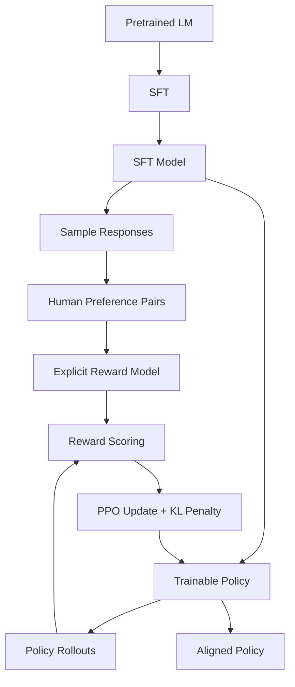
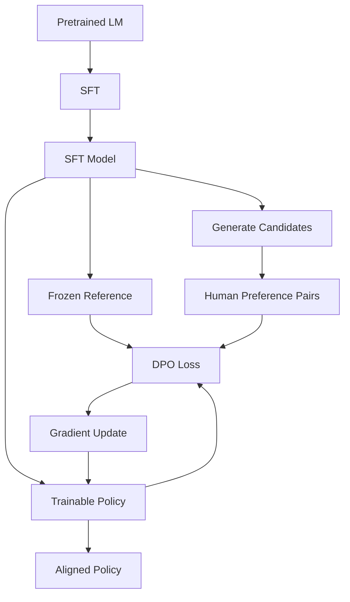

# Day 10：DPO——为什么可以绕过 Reward Model + PPO，但仍然需要 RL？

> **核心问题：**
>
> 1. RLHF 和 DPO 分别是如何利用人类偏好来训练大语言模型的？
> 2. 为什么 DPO 可以不显式训练 Reward Model，也不需要 PPO？
> 3. 既然 DPO 更简单，为什么我们仍然需要 Reinforcement Learning？
>
> 本文从一个简单的偏好数据例子出发，逐步理解经典 RLHF 的训练流程、DPO 的数学直觉以及两者的适用边界。
>
> **一句话总结：DPO 并不是证明强化学习没有必要，而是在特定的 KL-regularized RLHF 设定下，通过重新参数化 Reward Model，把原本需要“奖励建模 + 强化学习”的问题转化为一个直接优化语言模型的分类问题。**

---

## 一、问题从哪里来：如何让模型学会人类的偏好？

在理解 DPO 之前，需要先弄清楚一个问题：

**我们究竟希望通过人类反馈，让大语言模型学到什么？**

假设现在有一个经过 SFT（Supervised Fine-Tuning，监督微调）的语言模型。

用户问：

> 如何系统性地学习 Transformer？

模型生成了两个回答。

**回答 A：**

> 可以先学习 Attention 的计算原理，然后理解 Multi-Head Attention，接着学习 Transformer Block，最后尝试用 PyTorch 实现一个简单的 Transformer。建议每学习一个模块，都通过代码验证输入输出的形状以及计算过程。

**回答 B：**

> Transformer 是一种神经网络架构，广泛应用于自然语言处理。建议阅读相关资料进行学习。

显然，回答 A 更具体、更有指导性。

于是，人类标注员给出一个偏好：

$$
A \succ B
$$

即：

$$
y_w \succ y_l
$$

其中：

* \(x\)：用户输入的 Prompt。
* \(y_w\)：Chosen Response，即人类更喜欢的回答。
* \(y_l\)：Rejected Response，即人类相对不喜欢的回答。

于是，我们获得了一条偏好数据：

$$
(x,y_w,y_l)
$$

这里有一个非常关键的区别。

### 1.1 SFT 与 Preference Learning 的区别

SFT 的训练数据通常是：

$$
(x,y)
$$

它告诉模型：

> 对于输入 \(x\)，你应该尽可能生成目标回答 \(y\)。

其基本目标是最大化目标回答的概率：

$$
\mathcal{L}_{SFT}
=
-\mathbb{E}_{(x,y)\sim\mathcal{D}}
\left[\log\pi_\theta(y|x)\right]
$$

而 Preference Learning 的数据是：

$$
(x,y_w,y_l)
$$

它告诉模型：

> 对于同一个问题，回答 A 比回答 B 更符合人类偏好。

但是，这里并没有告诉模型：

* A 究竟值多少分？
* B 究竟值多少分？
* A 比 B 好多少？
* 怎样把这种偏好转化为参数更新？

因此，Preference Learning 的核心问题是：

**如何把人类的相对偏好转化为可以优化语言模型的训练信号？**

经典 RLHF 和 DPO，正是这个问题的两种不同解决思路。

---

## 二、经典 RLHF：先学习一个 Reward Model，再利用 RL 优化模型

RLHF 的全称是：

**Reinforcement Learning from Human Feedback（基于人类反馈的强化学习）。**

以 InstructGPT 为代表的经典 PPO-based RLHF pipeline，通常包含三个阶段 [1]：

1. Supervised Fine-Tuning（SFT）
2. Reward Model Training（奖励模型训练）
3. Reinforcement Learning（通常使用 PPO）

它的核心思想是：

> 既然人类能够判断哪个回答更好，那么我们能否训练一个模型来模仿人类的偏好，再让语言模型根据这个模型给出的奖励进行优化？

这个负责打分的模型，就是 Reward Model（RM）。

### 2.1 第一阶段：SFT

首先，使用高质量的指令数据训练一个基础模型。

例如：

```text
Prompt:
解释什么是 Transformer。

Target:
Transformer 是一种基于注意力机制的神经网络架构……
```

经过 SFT 后，模型获得基本的指令遵循能力。

但是，SFT 主要学习的是如何模仿给定答案，并不直接建模不同答案之间的偏好关系。

因此，接下来我们希望进一步优化模型的回答质量。

### 2.2 第二阶段：训练 Reward Model

假设我们拥有偏好数据：

$$
(x,y_w,y_l)
$$

现在训练一个 Reward Model：

$$
r_\phi(x,y)
$$

它接收 Prompt 和 Response，并输出一个标量奖励。

例如：

```text
Prompt + Response A
        ↓
   Reward Model
        ↓
      4.8

Prompt + Response B
        ↓
   Reward Model
        ↓
      1.7
```

我们希望：

$$
r_\phi(x,y_w)>r_\phi(x,y_l)
$$

但问题是，人类只提供了 A 优于 B，并没有提供 4.8 或 1.7 这样的分数。

那么 Reward Model 如何学习？

这里就用到了 **Bradley-Terry Model** [2]。

### 2.3 Bradley-Terry Model：从奖励差异推导偏好概率

Bradley-Terry Model 假设：

两个回答之间的偏好概率，可以由它们的 reward 差异来描述。

数学表达式为：

$$
P(y_w\succ y_l|x)
=
\sigma\left(
r_\phi(x,y_w)-r_\phi(x,y_l)
\right)
$$

其中：

$$
\sigma(z)=\frac{1}{1+e^{-z}}
$$

是 Sigmoid 函数。

这条公式的含义其实很直观。

**情况一：**

如果：

$$
r_\phi(x,y_w)\gg r_\phi(x,y_l)
$$

那么：

$$
P(y_w\succ y_l|x)\approx 1
$$

说明模型认为人类几乎一定会更喜欢 chosen response。

**情况二：**

如果：

$$
r_\phi(x,y_w)=r_\phi(x,y_l)
$$

那么：

$$
P(y_w\succ y_l|x)=0.5
$$

说明模型认为两者没有明显的偏好差异。

因此，可以利用人类偏好数据，通过最大似然估计训练 Reward Model：

$$
\mathcal{L}_{RM}
=
-\mathbb{E}_{(x,y_w,y_l)\sim\mathcal{D}}
\left[
\log\sigma\left(
r_\phi(x,y_w)-r_\phi(x,y_l)
\right)
\right]
$$

训练目标是让 Reward Model 对人类更喜欢的回答给出更高的相对评分。

需要注意：

**Reward Model 学到的是一个用于表达偏好的评分函数，而不一定是某种客观、绝对的回答质量分数。**

偏好数据主要约束的是两个回答的 reward 差异。

### 2.4 第三阶段：利用 PPO 优化语言模型

现在，我们已经有了一个能够自动评分的 Reward Model。

那么，一个自然的想法就是：

> 让语言模型生成回答，再利用 Reward Model 给回答打分，然后通过强化学习让模型生成更高奖励的回答。

这时，整个过程就变成：

```text
Language Model
      ↓
Generate Response
      ↓
Reward Model
      ↓
Scalar Reward
      ↓
PPO Update
      ↓
Updated Language Model
```

这里的 PPO（Proximal Policy Optimization）是一种策略优化算法 [3]。

其核心作用是利用 reward 信号更新语言模型，使其生成的回答能够获得更高的预期奖励。

但是，如果单纯最大化 Reward Model 的输出，也会引入新的问题。

### 2.5 为什么需要 KL Regularization？

Reward Model 并不是真正的人类。

它只是从有限的人类偏好数据中学习出来的近似评分函数。

因此，语言模型可能逐渐找到一些能够获得高 reward、但实际上并不符合人类真实偏好的回答。

这就是所谓的：

**Reward Hacking / Reward Overoptimization。**

为了限制模型过度偏离原始模型，经典 RLHF 通常加入 KL 惩罚项。

优化目标可以写成：

$$
\max_{\pi_\theta}
\mathbb{E}_{x\sim\mathcal D,\ y\sim\pi_\theta(\cdot|x)}
\left[
r_\phi(x,y)
\right]
-
\beta
\mathbb{E}_{x\sim\mathcal D}
\left[
D_{KL}\left(
\pi_\theta(\cdot|x)
\Vert
\pi_{ref}(\cdot|x)
\right)
\right]
$$

其中：

| 符号              | 含义                  |
| --------------- | ------------------- |
| \(\pi_\theta\)  | 当前正在训练的语言模型（Policy） |
| \(\pi_{ref}\)   | 参考模型，通常由 SFT 模型冻结得到 |
| \(r_\phi(x,y)\) | Reward Model 输出的奖励  |
| \(D_{KL}\)      | 衡量当前策略与参考策略的分布差异    |
| \(\beta\)       | 控制 KL 惩罚强度的系数       |

这条公式可以用一句话理解：

> **让模型尽可能获得更高的 Reward，同时不要让它过度偏离原来的 Reference Model。**

其中 \(\beta\) 越大，原目标对偏离参考模型的惩罚越强。

需要强调的是，KL Regularization 可以限制策略偏移，但并不能保证彻底消除 Reward Hacking。

### 2.6 经典 RLHF 完整训练 Pipeline



从这张图可以看出，经典 PPO-based RLHF 在偏好学习阶段实际上完成了两个独立任务：

**第一步：Reward Learning**

$$
Preference\ Data
\rightarrow
Reward\ Model
$$

让模型理解人类更偏好什么。

**第二步：Policy Optimization**

$$
Reward\ Model
\rightarrow
PPO
\rightarrow
Policy
$$

利用学到的奖励函数优化语言模型。

因此，整个过程可以概括为：

$$
\boxed{
Preference
\rightarrow
Reward\ Model
\rightarrow
RL
\rightarrow
Policy
}
$$

这套方案是有效的，但也比较复杂。

它需要训练独立的 Reward Model，并在 RL 阶段持续生成回答、计算奖励和更新策略。

于是，一个新的问题出现了：

**我们真的必须先训练 Reward Model，再使用 PPO 吗？**

---

## 三、DPO 的核心思想：能不能直接从 Preference 更新模型？

DPO 的全称是：

**Direct Preference Optimization（直接偏好优化）。**

由 Rafailov 等人在论文 *Direct Preference Optimization: Your Language Model is Secretly a Reward Model* 中提出 [4]。

论文试图解决的核心问题是：

> 既然训练数据已经告诉我们哪个回答更好，能否直接利用这些偏好数据更新语言模型，而不必额外训练 Reward Model 并执行 PPO？

回到最初的例子。

我们已经知道：

$$
A\succ B
$$

经典 RLHF 的做法是：

```text
A > B
  ↓
Train Reward Model
  ↓
r(A) > r(B)
  ↓
PPO
  ↓
Update Policy
```

DPO 希望把它简化成：

```text
A > B
  ↓
DPO Loss
  ↓
Update Policy
```

表面上看，DPO 只是减少了两个训练阶段。

但它并不是简单地认为：

“既然 A 比 B 好，那就增加 A 的概率，降低 B 的概率。”

真正的核心在于：

**DPO 发现，在特定的 KL-regularized RLHF 目标下，Reward Function 和最优 Policy 之间存在一个可以利用的数学关系。**

通过这个关系，可以把关于 Reward Model 的优化问题重新写成关于 Policy 的优化问题。

这就是 DPO 能够绕过显式 Reward Model 和 PPO 的原因。

---

## 四、为什么 DPO 在数学上可以绕过 Reward Model？

这是理解 DPO 最关键的一部分。

不需要记住所有推导细节，但一定要理解每一步在做什么。

### 4.1 从 RLHF 的优化目标出发

之前已经看到，经典 RLHF 希望最大化：

$$
\mathbb{E}_{y\sim\pi(\cdot|x)}
[r(x,y)]
-
\beta D_{KL}
\left(
\pi(\cdot|x)\Vert\pi_{ref}(\cdot|x)
\right)
$$

为了便于理解，这里先固定一个 Prompt \(x\)。

那么我们要解决的问题就是：

> 在获得更高 Reward 的同时，找到一个不要偏离 Reference Model 太远的最优 Policy。

对于这个优化问题，在相应的数学假设下，其最优 Policy 可以写成：

$$
\pi_r^*(y|x)
=
\frac{1}{Z(x)}
\pi_{ref}(y|x)
\exp\left(
\frac{r(x,y)}{\beta}
\right)
$$

其中：

$$
Z(x)
=
\sum_y
\pi_{ref}(y|x)
\exp\left(
\frac{r(x,y)}{\beta}
\right)
$$

\(Z(x)\) 是归一化因子，保证所有回答的概率加起来等于 1。

这条公式实际上告诉我们：

**最优 Policy 的概率分布由 Reference Policy 和 Reward 共同决定。**

奖励越高的回答，在其他条件相同时，会获得更高的相对概率。

### 4.2 将公式反过来：用 Policy 表示 Reward

接下来，是 DPO 最重要的一步。

由：

$$
\pi_r^*(y|x)
=
\frac{1}{Z(x)}
\pi_{ref}(y|x)
\exp\left(
\frac{r(x,y)}{\beta}
\right)
$$

经过取对数、移项，可以得到：

$$
\boxed{
r(x,y)
=
\beta
\log
\frac{
\pi_r^*(y|x)
}{
\pi_{ref}(y|x)
}
+
\beta\log Z(x)
}
$$

这条公式意味着：

**Reward 可以表示为最优 Policy 相对于 Reference Policy 的 log-probability ratio，再加上一个只与 Prompt 有关的常数项。**

可以把它理解成：

```text
Reward
   ≈
Policy 相对 Reference 的概率变化
   +
与 Prompt 有关的归一化项
```

注意，这不是说任何一个随意训练的 Policy 都天然对应真实的人类 Reward。

而是说：

**对于上述 KL-regularized RLHF 问题的最优策略，存在这样的解析关系。**

DPO 正是利用这一关系，对学习目标进行重新参数化。

### 4.3 为什么归一化项可以消掉？

回忆之前的 Bradley-Terry Model：

$$
P(y_w\succ y_l|x)
=
\sigma\left(
r(x,y_w)-r(x,y_l)
\right)
$$

它只依赖两个回答的 Reward 差异。

现在把刚才的 Reward 表达式代入。

对于 Chosen Response：

$$
r(x,y_w)
=
\beta
\log
\frac{
\pi^*(y_w|x)
}{
\pi_{ref}(y_w|x)
}
+
\beta\log Z(x)
$$

对于 Rejected Response：

$$
r(x,y_l)
=
\beta
\log
\frac{
\pi^*(y_l|x)
}{
\pi_{ref}(y_l|x)
}
+
\beta\log Z(x)
$$

两者相减：

$$
\begin{aligned}
r(x,y_w)-r(x,y_l)
=&\ \beta\log
\frac{\pi^*(y_w|x)}{\pi_{ref}(y_w|x)}
\\
&-\beta\log
\frac{\pi^*(y_l|x)}{\pi_{ref}(y_l|x)}
\end{aligned}
$$

因为两个回答对应的是同一个 Prompt，所以：

$$
\beta\log Z(x)-\beta\log Z(x)=0
$$

归一化项直接消失了。

这意味着，我们不需要显式计算 \(Z(x)\)，也不需要先训练一个独立的 Reward Model 来计算两个回答之间的 Reward 差异。

只要能够计算：

* 当前 Policy 对 chosen/rejected 的概率；
* Reference Policy 对 chosen/rejected 的概率；

就可以构造偏好学习目标。

这一步是 DPO 从 Reward Optimization 转向 Direct Policy Optimization 的关键。

---

## 五、DPO Loss 到底在优化什么？

将刚才的结果代入 Bradley-Terry Model，并用参数化的当前模型 \(\pi_\theta\) 去拟合偏好数据，最终得到：

$$
\boxed{
\mathcal{L}_{DPO}
=
-\mathbb{E}_{(x,y_w,y_l)\sim\mathcal D}
\left[
\log\sigma
\left(
\beta
\log
\frac{\pi_\theta(y_w|x)}{\pi_{ref}(y_w|x)}
-
\beta
\log
\frac{\pi_\theta(y_l|x)}{\pi_{ref}(y_l|x)}
\right)
\right]
}
$$

这就是 DPO 最核心的公式。

第一次看到这个公式可能觉得很复杂，但实际上可以把它拆成三个部分。

### 5.1 第一部分：计算 Chosen 的相对概率变化

$$
\log
\frac{\pi_\theta(y_w|x)}
{\pi_{ref}(y_w|x)}
$$

它描述：

当前模型相对于参考模型，对 Chosen Response 的概率倾向发生了怎样的变化。

如果比值大于 1，对应的 log-ratio 就大于 0。

### 5.2 第二部分：计算 Rejected 的相对概率变化

$$
\log
\frac{\pi_\theta(y_l|x)}
{\pi_{ref}(y_l|x)}
$$

它描述：

当前模型相对于参考模型，对 Rejected Response 的概率倾向发生了怎样的变化。

### 5.3 第三部分：比较两个变化

定义：

$$
\Delta_\theta
=
\log
\frac{\pi_\theta(y_w|x)}{\pi_{ref}(y_w|x)}
-
\log
\frac{\pi_\theta(y_l|x)}{\pi_{ref}(y_l|x)}
$$

那么，单个偏好样本的 DPO Loss 可以简化成：

$$
\mathcal L_{DPO}
=
-\log\sigma(\beta\Delta_\theta)
$$

它的直觉就非常清楚了：

**DPO 希望 Chosen 相对于 Reference 的概率提升程度，大于 Rejected 相对于 Reference 的概率提升程度。**

也就是希望：

$$
\Delta_\theta>0
$$

并尽可能增大这一偏好 margin。

这里需要注意：

DPO 并不要求：

$$
\pi_\theta(y_w|x)>\pi_\theta(y_l|x)
$$

一定成立。

它真正关心的是：

$$
\frac{\pi_\theta(y_w|x)}
{\pi_{ref}(y_w|x)}
>
\frac{\pi_\theta(y_l|x)}
{\pi_{ref}(y_l|x)}
$$

也就是说：

> **重点不是当前模型绝对更喜欢哪个回答，而是相对于参考模型，它是否朝人类偏好的方向发生了变化。**

这也是 DPO 和简单地对 chosen response 做 SFT 的重要区别。

另外，在实际语言模型中，\(y\) 通常是一整段回答，而不是单个 Token。

完整回答的 log-probability 可以写成：

$$
\log\pi_\theta(y|x)
=
\sum_{t=1}^{T}
\log P_\theta(y_t|x,y_{<t})
$$

因此，实现 DPO 时，一般需要计算 chosen 和 rejected 中各个目标 Token 的 log-probability，再求和形成序列级分数。

### 5.4 通过一个数字例子理解 DPO

假设为了简化分析，我们把所有可能回答抽象成 A、B 和其他回答三个类别。

Reference Model 对这些回答的概率为：

| 回答          | Reference Model |
| ----------- | --------------: |
| A（Chosen）   |            0.20 |
| B（Rejected） |            0.20 |
| 其他回答        |            0.60 |

起初，当前模型与 Reference Model 相同。

因此：

$$
\Delta_\theta=0
$$

对应的偏好预测概率为：

$$
\sigma(0)=0.5
$$

DPO Loss 为：

$$
-\log(0.5)\approx0.693
$$

现在经过训练，当前模型变成：

| 回答          | Reference Model | Current Policy |
| ----------- | --------------: | -------------: |
| A（Chosen）   |            0.20 |           0.30 |
| B（Rejected） |            0.20 |           0.10 |
| 其他回答        |            0.60 |           0.60 |

假设为了方便计算，设置：

$$
\beta=1
$$

此时，Chosen 的相对概率比值为：

$$
\frac{0.30}{0.20}=1.5
$$

Rejected 的相对概率比值为：

$$
\frac{0.10}{0.20}=0.5
$$

因此：

$$
\Delta_\theta
=
\log(1.5)-\log(0.5)
=
\log 3
$$

代入 Sigmoid：

$$
\sigma(\log3)=0.75
$$

DPO Loss 为：

$$
-\log(0.75)\approx0.288
$$

可以看到，Loss 从约 0.693 降低到了 0.288。

这个例子说明：

* 当前模型相对于 Reference Model 更偏向 A；
* 当前模型相对于 Reference Model 更不偏向 B；
* 这种变化与人类给出的 A 优于 B 一致；
* 因此，DPO Loss 下降。

这里的 0.75 是 **DPO 偏好模型预测的 A 战胜 B 的概率**，并不是语言模型生成 A 的概率。

需要强调：这个例子是为了理解公式而构造的简化离散概率分布，并不是某个真实语言模型的实验结果。

### 5.5 DPO 中的 Beta 控制什么？

DPO Loss 中的 \(\beta\) 来自原始 KL-regularized RLHF 目标。

在原始优化问题中，\(\beta\) 控制 Reward Maximization 与 KL Regularization 之间的权衡。

而在 DPO Loss 中：

$$
\mathcal L_{DPO}
=
-\log\sigma(\beta\Delta_\theta)
$$

\(\beta\) 直接缩放偏好分类的 logit，并影响梯度大小与学习动态。

从理论来源上说，它对应原 RLHF 问题中的 KL 正则化强度。

但在实际神经网络训练时，不应把它机械地理解为“增大 \(\beta\) 就一定让每一步模型更新更小”。

实际效果还会受到参数化、数据和训练过程的影响。

---

## 六、DPO 的完整训练 Pipeline

理解公式以后，DPO 的训练流程就很容易看懂了。



图中展示的是一种典型的数据构建方式：由 SFT 模型生成候选回答，再收集人类偏好。实际训练也可以复用已有的 Preference Dataset。

DPO 的训练可以概括为以下过程：

**首先，准备两个模型。**

* Policy Model：需要更新参数的语言模型。
* Reference Model：通常由 SFT 模型复制并冻结参数得到。

**然后，准备 Preference Dataset。**

每条样本包括：

$$
(x,y_w,y_l)
$$

**最后，计算 DPO Loss 并更新 Policy Model。**

训练过程中：

* Policy Model 参与梯度计算和参数更新；
* Reference Model 只提供基准 log-probability，不进行参数更新；
* 不需要额外训练显式 Reward Model；
* 不需要 PPO 的在线 rollout 与策略更新循环。

DPO 原论文主要使用离线偏好数据训练模型，其官方参考实现也将训练组织成 SFT 和 DPO Preference Learning 两个阶段 [4][5]。

因此，可以将 DPO 概括为：

$$
\boxed{
Preference\ Data
\rightarrow
DPO\ Loss
\rightarrow
Policy
}
$$

这里的 Direct，就体现在：

**直接从 Preference Data 构造 Policy 的训练损失，而不必经过独立 Reward Model 和 PPO 这两个阶段。**

---

## 七、一个容易被误解的地方：DPO 真的不需要 Reward 吗？

严格来说：

**DPO 不需要显式训练一个独立的 Reward Model，但它并没有完全抛弃 Reward 的概念。**

还记得前面的关系吗？

$$
r(x,y)
=
\beta
\log
\frac{\pi^*(y|x)}{\pi_{ref}(y|x)}
+
\beta\log Z(x)
$$

由于在比较同一个 Prompt 下的回答时，只与 Prompt 有关的常数项会相互抵消，因此可以定义：

$$
\boxed{
\hat r_\theta(x,y)
=
\beta
\log
\frac{\pi_\theta(y|x)}
{\pi_{ref}(y|x)}
}
$$

这就是 DPO 中的 **Implicit Reward（隐式奖励）**。

它并不是通过一个独立的 Reward Network 预测出来的，而是由当前 Policy 和 Reference Policy 的概率比值决定的。

所以，可以把两者理解为：

**经典 PPO-based RLHF：**

```text
Preference Data
      ↓
Explicit Reward Model
      ↓
Reward
      ↓
RL Optimization
      ↓
Policy
```

**DPO：**

```text
Preference Data
      ↓
Policy + Reference
      ↓
Implicit Reward Difference
      ↓
Preference Classification Loss
      ↓
Policy Update
```

因此，DPO 的核心创新不是：

“我们不需要 Reward 了。”

而是：

> **我们不需要把 Reward Model 作为一个单独训练、再通过 RL 优化的神经网络组件。**

这也是 DPO 论文标题 *Your Language Model is Secretly a Reward Model* 所强调的思想。

---

## 八、RLHF 与 DPO：到底有什么区别？

到这里，我们可以把两者放在一起比较。

需要先明确：这里讨论的 RLHF 特指**经典的 PPO-based RLHF 流程**，而不是所有使用人类反馈进行模型对齐的方法。

| 对比维度            | 经典 PPO-based RLHF                | 原始 DPO                                     |
| --------------- | -------------------------------- | ------------------------------------------ |
| 训练数据            | 人类偏好数据，以及 RL 阶段的模型采样结果           | 预先收集的 Preference Pairs                     |
| 显式 Reward Model | 需要                               | 不需要                                        |
| Reward 表达       | 独立模型输出的标量                        | Policy 与 Reference 的 log-probability ratio |
| Policy 优化方式     | PPO 等强化学习算法                      | 直接最小化 DPO Loss                             |
| 在线 Rollout      | RL 阶段通常需要                        | 原始离线 DPO 训练不需要                             |
| Reference Model | 通常需要                             | 通常需要                                       |
| 训练流程            | 多阶段，涉及 RM 与 RL 优化                | 相对简单，监督式损失优化                               |
| 主要适合的问题         | Reward-based Policy Optimization | 基于偏好对的直接策略优化                               |

这里最重要的区别并不是：

“DPO 比 RLHF 少了几个模型。”

而是两者的优化方式不同。

经典 RLHF：

> 先把人类偏好转化为一个显式奖励函数，再通过 RL 去优化这个奖励函数。

DPO：

> 在特定理论假设下，用 Policy 重新参数化 Reward，直接基于 Preference Data 优化 Policy。

另外，从更广义的模型对齐角度看，DPO 仍然是在利用人类反馈优化模型。

所以把“RLHF”和“DPO”理解成两个在所有语境下完全互斥的概念，也是不准确的。

---

## 九、最重要的问题：既然 DPO 更简单，为什么还需要 RL？

如果只理解 DPO 的训练公式，很容易得到一个错误的结论：

> 既然 DPO 不需要 Reward Model，也不需要 PPO，而且训练更简单，那是不是以后完全可以不用 RL 了？

答案是否定的。

因为：

**DPO 解决的是一类特定的 Preference Optimization 问题，而 RL 能够解决的策略优化问题更加广泛。**

下面从三个角度理解。

### 9.1 原始 DPO 主要依赖 Offline Preference Data

标准 DPO 的训练数据通常是：

$$
\mathcal D
=
\{(x_i,y_{w,i},y_{l,i})\}
$$

这些偏好数据在训练前已经收集好。

例如：

```text
Prompt 1:
    Chosen: A
    Rejected: B

Prompt 2:
    Chosen: C
    Rejected: D

Prompt 3:
    Chosen: E
    Rejected: F
```

训练过程本质上是在学习：

> 对于数据集中出现的这些回答比较，怎样调整 Policy 才更符合偏好标签？

但是，假设一个模型正在学习复杂数学推理。

最开始它只能生成质量一般的推理过程。

随着训练进行，它可能逐渐掌握新的推理方法，生成以前很少出现、甚至从未在原始数据集中出现过的解题轨迹。

此时，我们可能希望：

1. 当前模型生成新的推理轨迹。
2. 对这些轨迹进行评估。
3. 根据评估结果优化模型。
4. 更新后的模型继续生成新的轨迹。
5. 不断重复这个过程。

这种方式需要模型在训练期间持续采样，并利用新的反馈调整策略。

**Online RL 天然适合这种“采样—评估—更新—再采样”的训练闭环。**

相比之下，原始 DPO 主要依赖已有的偏好对，不能仅凭一个固定数据集自动获得所有新轨迹的反馈。

当然，这并不意味着 DPO 永远不能用于在线训练。

我们也可以不断采样新回答、重新构造偏好对，再执行 DPO 更新。这类方法通常被称为 Online DPO 或相关在线偏好优化变体。

因此，更准确的区别是：

**原始 DPO 是离线偏好优化方法，而 RL 提供了直接利用在线交互反馈优化策略的通用框架。**

### 9.2 有些任务可以直接获得 Reward，不需要先构造 Preference Pairs

再看另一个场景。

假设我们希望训练一个 Coding Agent。

用户要求：

> 编写一个函数，并确保它通过所有单元测试。

模型可以生成代码：

```text
Generate Code
      ↓
Run Unit Tests
      ↓
Test Results
      ↓
Reward
```

我们可以设计一个非常简单的奖励：

$$
r(x,y)
=
\begin{cases}
1 & \text{通过全部测试}\\
0 & \text{未通过全部测试}
\end{cases}
$$

这里不一定需要人类告诉我们：

“代码 A 比代码 B 更好。”

因为环境已经能够提供相对明确的任务成功信号。

类似的场景包括：

* 数学题：最终答案是否正确。
* 代码生成：测试用例是否通过。
* 游戏或模拟环境：是否完成目标、获得多少分数。
* Agent 任务：是否成功完成指定操作。

这些任务中，Reward 可以来自程序、规则、验证器或环境。

此时，直接使用 RL 优化预期奖励是一条自然的路线。

例如，DeepSeek-R1 的研究使用强化学习提升推理能力，并在数学、代码等任务中使用基于规则的奖励信号 [6]。

这说明：

**RL 的价值并不依赖于是否需要一个通过人类偏好训练出来的 Reward Model。**

Reward 可以是学习得到的，也可以是环境直接提供的。

因此：

> DPO 不需要显式 Reward Model，并不能推导出 RL 不再重要。

### 9.3 复杂 Agent 任务涉及多步交互与探索

DPO 的基本训练样本是：

$$
(x,y_w,y_l)
$$

即同一个输入下，两个完整回答之间的偏好关系。

但一个真正的 Agent 可能需要执行：

```text
Receive Task
     ↓
Plan
     ↓
Call Tool
     ↓
Observe Result
     ↓
Choose Next Action
     ↓
Call Tool Again
     ↓
Receive Feedback
     ↓
Continue
     ↓
Task Success / Failure
```

这里会出现更一般的强化学习问题：

**第一，模型需要探索。**

它可能需要尝试不同的动作序列，发现以前不知道的有效策略。

**第二，奖励可能延迟出现。**

某个中间步骤暂时没有明显好处，但可能对最终任务成功至关重要。

**第三，需要处理长期收益。**

一个局部看起来不错的动作，不一定能带来整个任务的最优结果。

这些问题都属于强化学习长期研究的范畴。

虽然可以将整条 Agent 轨迹视作回答，并构造轨迹级偏好数据进行 DPO 训练，但这并不等于固定的 pairwise preference classification 就自动解决了探索、状态分布变化和延迟奖励等问题。

因此，对于复杂的交互式环境，RL 仍然有非常重要的价值。

---

## 十、DPO 的边界：它并不是在所有情况下都等价于 PPO

在求职面试中，这一点尤其值得强调。

DPO 的理论推导依赖特定的数学设定，例如：

* 优化目标采用 KL-regularized expected reward。
* 偏好关系可以由 Bradley-Terry 等概率偏好模型描述。
* 存在给定的 Reference Policy，并满足相应的分布支持条件。
* 通过策略与参考策略的概率比值重新参数化奖励函数。

在这些条件下，可以建立 Reward 与最优 Policy 之间的解析联系，从而构造 DPO Objective。

但这不意味着：

$$
DPO = PPO
$$

也不意味着：

> 任意任务、任意 Reward Function、任意有限数据集，只要使用 DPO 就必然能够得到与 PPO 相同的模型。

原因在于，理论上的最优策略关系与实际深度学习训练之间仍然存在差异。

实际训练还受到以下因素影响：

**数据覆盖范围。** 如果 Preference Dataset 没有包含足够多的优质回答或不同类型的比较关系，模型的优化可能受到限制。

**偏好标注噪声。** 人类偏好可能不一致，也可能包含错误标注。

**模型参数化与优化误差。** 有限参数的神经网络不一定能够表达理论上的最优 Policy，梯度下降也不保证达到全局最优。

**分布偏移。** 如果训练期间模型生成的回答逐渐偏离偏好数据的分布，已有数据对新回答的约束可能不足。

因此，我们应该把 DPO 理解为：

> **在一类重要的偏好优化设定下，通过重新参数化，把经典 RLHF 中复杂的两阶段优化流程简化成直接的 Policy Learning。**

而不是：

> DPO 证明了所有强化学习步骤都可以删除。

---

## 十一、几个非常容易混淆的概念

### 误区一：DPO 不需要 Reward

不准确。

DPO 不需要**显式训练一个独立 Reward Model**，但它仍然可以定义隐式奖励：

$$
\hat r_\theta(x,y)
=
\beta
\log
\frac{\pi_\theta(y|x)}{\pi_{ref}(y|x)}
$$

### 误区二：DPO 就是对 Chosen Response 做 SFT

不准确。

普通 SFT 主要最大化目标回答的 likelihood。

DPO 则同时使用 Chosen、Rejected 和 Reference Policy，并通过相对 log-probability ratio 构造偏好损失。

两者的目标并不相同。

### 误区三：DPO 训练时完全不需要其他模型

不准确。

标准 DPO 通常仍然使用冻结的 Reference Model 来计算参考 log-probability。

它省掉的是独立 Reward Model 训练以及 PPO 的 RL 优化阶段，而不是所有额外的计算。

### 误区四：DPO 比 PPO 简单，所以一定更好

不准确。

简单意味着较低的训练系统复杂度，但不能直接推导出在所有任务、所有数据条件下都有更好的效果。

选择 DPO 还是 RL，需要结合偏好数据、奖励来源、在线交互需求和计算预算判断。

### 误区五：RLHF 就等于 PPO

不准确。

PPO 是一种强化学习算法，而 RLHF 是利用人类反馈进行强化学习的训练范式。

经典 RLHF 经常使用 PPO，但 RLHF 并不在算法层面等同于 PPO。

同样，RL 也不等于 PPO。

PPO 只是更广泛的 RL 算法家族中的一种方法。

---

## 十二、面试中应该如何回答？

### Q1：为什么 DPO 可以绕过 Reward Model 和 PPO？

**参考回答：**

DPO 的核心思想是利用 KL-regularized RLHF 目标中最优 Policy 与 Reward Function 的解析关系。

在该设定下，可以把 Reward 表示为最优 Policy 相对于 Reference Policy 的 log-probability ratio，加上一个只与 Prompt 有关的归一化项。

由于 Bradley-Terry Preference Model 只依赖同一个 Prompt 下两个回答的 Reward 差异，归一化项会在相减时抵消。

因此，我们可以直接利用 Chosen 和 Rejected 的 Policy log-probability 构造偏好分类损失，从而优化语言模型，而不需要显式训练 Reward Model，也不需要再利用 PPO 最大化这个 Reward Model。

### Q2：既然 DPO 简单，为什么还需要 RL？

**参考回答：**

DPO 主要解决特定设定下基于偏好对的直接策略优化问题，原始方法通常使用固定的离线 Preference Dataset。

但是 RL 的适用范围更广。

在需要在线采样、策略探索、多步环境交互，或者能够直接获得可验证奖励的任务中，我们可以通过 RL 持续生成新轨迹，并根据环境反馈优化预期收益。

例如，代码生成任务可以通过单元测试产生奖励，数学推理任务也可以通过答案验证获得奖励。

因此，DPO 简化的是一类 RLHF Preference Optimization Pipeline，而不是完全取代 Reinforcement Learning。

### Q3：DPO 的 Reference Model 有什么作用？

**参考回答：**

Reference Model 提供一个固定的概率分布基准。

DPO 并不是只看当前模型对 Chosen 和 Rejected 的绝对概率，而是比较它们相对于 Reference Model 的概率变化。

这一相对概率关系来自 KL-regularized RLHF 的数学推导，可以使 DPO 的偏好优化与原始带 KL 正则项的策略优化目标建立联系。

### Q4：DPO 中的 Beta 有什么作用？

**参考回答：**

Beta 来源于原始 KL-regularized RLHF Objective，用于控制 Reward Maximization 与偏离 Reference Policy 的代价之间的权衡。

在 DPO 中，它缩放 Chosen 与 Rejected 的相对 log-probability margin，进而影响损失和训练梯度。

理论上，它与 KL 正则强度有关，但实际训练中对策略偏移的影响还取决于模型、数据以及优化过程。

---

## 十三、总结：我对 DPO 的最终理解

回顾整篇文章，最重要的不是背下来 DPO Loss，而是理解 DPO 为什么会出现。

经典 PPO-based RLHF 的思路是：

$$
\boxed{
Human\ Preference
\rightarrow
Reward\ Model
\rightarrow
PPO
\rightarrow
Policy
}
$$

先把人类偏好学成一个显式奖励函数，再通过 RL 优化这个奖励函数。

而 DPO 的思路是：

$$
\boxed{
Human\ Preference
\rightarrow
DPO\ Objective
\rightarrow
Policy
}
$$

在特定的 KL-regularized RLHF 目标下，Reward 与最优 Policy 之间存在解析关系。

通过重新参数化，我们可以将原来对 Reward Function 的偏好学习转化为对 Policy 的直接优化。

所以 DPO 最重要的创新是：

**把“显式学习 Reward + 使用 RL 优化 Reward”合并成一个直接从 Preference Data 学习 Policy 的过程。**

但 DPO 的简化并不意味着 RL 不再重要。

因为现实中的模型训练不仅包括离线偏好学习，还可能涉及：

* 在线探索和新的轨迹采样；
* 来自验证器或环境的奖励；
* 多步 Agent 交互；
* 延迟奖励和长期策略优化。

因此，我认为理解 DPO 最重要的是记住下面这句话：

> **DPO 不是 Reinforcement Learning 的全面替代品，而是为一类 Preference Optimization 问题提供了一种更直接、更简单的策略优化方式。**

当我们拥有高质量的 Preference Pairs，希望进行离线偏好对齐时，DPO 是一个自然的选择。

而当任务需要在线探索、环境反馈和持续的策略改进时，RL 仍然是非常重要的优化框架。

**如果能够真正解释这两条训练 Pipeline 的差异，以及 DPO 为什么能够消掉显式 Reward Model 与 PPO，就已经掌握了 DPO 最重要的思想。**

---

## 参考文献

**[1] Ouyang, L., et al. (2022). Training Language Models to Follow Instructions with Human Feedback.**

* 论文：https://arxiv.org/abs/2203.02155
* 说明：InstructGPT 原论文，介绍经典的 SFT、Reward Model Training 和 PPO 三阶段 RLHF Pipeline。

**[2] Bradley, R. A., & Terry, M. E. (1952). Rank Analysis of Incomplete Block Designs: I. The Method of Paired Comparisons. Biometrika.**

* 论文：https://doi.org/10.1093/biomet/39.3-4.324
* 说明：Bradley-Terry 偏好模型的经典来源，用于理解如何根据两个回答的奖励差异建立偏好概率模型。

**[3] Schulman, J., et al. (2017). Proximal Policy Optimization Algorithms.**

* 论文：https://arxiv.org/abs/1707.06347
* 说明：PPO 原论文，用于理解经典 RLHF 中的 Policy Optimization 阶段。

**[4] Rafailov, R., Sharma, A., Mitchell, E., Ermon, S., Manning, C. D., & Finn, C. (2023). Direct Preference Optimization: Your Language Model is Secretly a Reward Model. NeurIPS 2023.**

* 论文：https://arxiv.org/abs/2305.18290
* HTML 全文：https://arxiv.org/html/2305.18290v3
* 说明：DPO 原论文。本文关于最优 Policy 与 Reward Function 的关系、DPO Loss、Implicit Reward 以及偏好优化流程的主要理论依据。

**[5] Mitchell, E., et al. Direct Preference Optimization — Reference Implementation.**

* GitHub：https://github.com/eric-mitchell/direct-preference-optimization
* 说明：DPO 作者提供的参考实现，包含 SFT、DPO Loss、Reference Model 和 Preference Dataset 等相关代码。

**[6] DeepSeek-AI, Guo, D., et al. (2025). DeepSeek-R1: Incentivizing Reasoning Capability in LLMs via Reinforcement Learning.**

* 论文：https://arxiv.org/abs/2501.12948
* Nature 论文：https://www.nature.com/articles/s41586-025-09422-z
* 说明：用于理解在大模型推理训练中，如何利用强化学习及基于规则的可验证奖励优化模型能力，也是思考“为什么有 DPO 仍然需要 RL”的重要实例。
