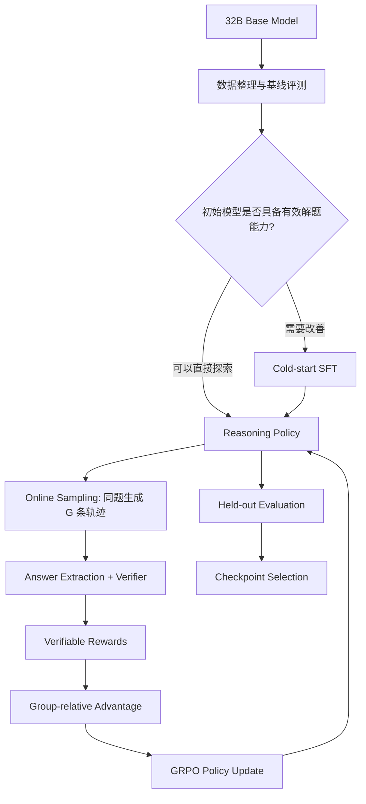

# Day 15｜第二次考试：彻底理解 PPO、GRPO、DPO、RLVR，并设计一个 32B Reasoning RL Pipeline

> **所属系列**：大模型后训练（LLM Post-training）与强化学习（Reinforcement Learning）
>
> **本文主题**：PPO / GRPO / DPO / RLVR 的核心区别，以及如何从一个 32B Base Model 出发，设计完整的数学推理强化学习系统。
>
> **学习目标**：不仅知道这几个名词是什么意思，还要理解它们分别解决了什么问题、为什么会被提出，以及如何在真实工程中组合使用。

---

## 一、前言：为什么我们要学习这些算法？

在学习大语言模型后训练的过程中，我曾经有一个疑问：

**既然 SFT 已经可以教模型解数学题了，为什么还需要 PPO、GRPO 这样的强化学习算法？**

例如，我们希望模型学会解决下面的问题：

```text
Question:
求解方程 x² - 5x + 6 = 0。

Expected Answer:
x = 2 或 x = 3
```

使用 SFT（Supervised Fine-Tuning）时，我们会提供一份正确解答，让模型模仿它。

但数学题可能有多种正确的求解方式：

* 可以使用因式分解。
* 可以使用求根公式。
* 可以尝试代入验证。
* 对更复杂的问题，还可能存在不同的证明思路。

SFT 的核心是模仿给定数据。

如果我们只提供一种解法，模型主要学习的就是这条解题轨迹。

那么，是否有一种方法可以让模型**自己尝试不同解法，通过最终结果判断哪些尝试值得强化**？

这正是 Reasoning RL（推理强化学习）想要解决的问题之一。

我们可以把两种训练方式理解为：

**SFT：**

> 老师告诉学生正确解法，学生学习模仿。

**Reasoning RL：**

> 学生独立尝试不同解法，老师只负责判卷。做对的解题行为得到强化，做错的得到抑制。

当然，这只是帮助理解的比喻。

在真实训练中，RL 并不能保证模型每一步推理都正确，它直接优化的是由 reward 定义的目标。

理解了这一点，我们就可以进入本文的核心问题：

**PPO、GRPO、DPO、RLVR，究竟有什么区别？**

---

## 二、一张表看懂 PPO、GRPO、DPO、RLVR

首先需要明确一个容易混淆的问题：

**PPO、GRPO、DPO 与 RLVR 并不是严格处于同一层级的概念。**

* PPO、GRPO 是强化学习中的策略优化方法。
* DPO 是基于偏好数据直接优化策略的方法。
* RLVR 强调使用可验证的结果作为强化学习的 reward。

因此，RLVR 可以和 PPO 组合，也可以和 GRPO 组合。

例如：

```text
RLVR + PPO

RLVR + GRPO
```

都可以是一套合理的训练方案。

### 2.1 核心对比表

| 对比维度                | PPO                                            | GRPO                                | DPO                                   | RLVR                                 |
| ------------------- | ---------------------------------------------- | ----------------------------------- | ------------------------------------- | ------------------------------------ |
| **需不需要 Critic**     | 经典 Actor-Critic PPO 通常需要                       | 不需要独立 Critic                        | 不需要                                   | 取决于所使用的优化算法                          |
| **Reward 来源**       | Reward Model、规则奖励或环境反馈                         | Reward Model、规则奖励或 Verifier         | Chosen / Rejected 偏好数据，不直接计算显式 Reward | 可验证结果，例如数学答案、代码测试、形式化证明              |
| **Online Sampling** | 通常需要                                           | 通常需要同题多次采样                          | 经典 DPO 通常使用离线偏好数据                     | Reasoning RL 中通常在线采样，但并非定义上的必要条件     |
| **Advantage**       | 利用 Value Function 估计，常使用 GAE                   | 利用同组 Reward 的相对差异估计                 | 不显式计算 Advantage                       | 由所搭配的算法决定                            |
| **KL**              | PPO 自身有 Clipping；LLM RLHF 中通常额外使用 Reference KL | 原始 GRPO 包含 Reference KL，也有移除 KL 的变体 | 基于 KL 约束目标推导，具有隐式 KL 正则化关系            | 取决于所使用的优化算法                          |
| **主要问题**            | Critic 成本高、训练系统复杂、稳定性问题                        | 同组奖励无差异时缺少学习信号、Rollout 成本高          | 依赖偏好数据，经典离线 DPO 缺少在线探索                | Reward 稀疏、Verifier 错误、Reward Hacking |

### 2.2 用一句话分别理解

| 方法   | 最直观的理解                 |
| ---- | ---------------------- |
| PPO  | 这次表现比 Critic 预测的好多少？   |
| GRPO | 同一道题的多个答案，哪个比组内平均表现更好？ |
| DPO  | 两个答案中，应该提高哪个答案的相对概率？   |
| RLVR | 不靠主观打分，而是用可以验证的结果判卷。   |

这张表是本文最重要的基础。

接下来我们深入理解它背后的原理。

---

## 三、理解 PPO 和 GRPO 的关键：什么是 Advantage？

在正式学习 PPO、GRPO 之前，我们必须先理解一个概念：

**Advantage（优势函数）。**

### 3.1 为什么不能直接使用 Reward？

假设一个模型做了一道数学题。

最终答案正确，因此：

$$
R=1
$$

那么，我们应该给这次生成多大的正向训练信号？

乍一看，似乎答对就应该奖励。

但考虑两个场景。

**场景 A：**

模型解答：

```text
1 + 1 = ?
```

答对的概率本来就很高。

**场景 B：**

模型解答一道复杂的数学竞赛题。

此前模型通常无法正确解决，但这次恰好找到了一条成功的解题路径。

虽然两个场景最终都获得了 Reward = 1，但它们的意义并不相同。

第二种情况可能包含更多值得强化的行为。

因此，我们希望衡量：

> **这次行为的结果，比某种基准表现好多少？**

这就引出了 Advantage：

$$
A(s,a)=Q(s,a)-V(s)
$$

其中：

* \(s\)：当前状态。
* \(a\)：当前动作。
* \(Q(s,a)\)：在状态 \(s\) 执行动作 \(a\) 后的预期回报。
* \(V(s)\)：在状态 \(s\) 下按照当前策略行动的预期回报。

对于语言模型，状态可以理解为当前 Prompt 以及已经生成的 Token，动作就是下一个 Token 的选择。

为了便于理解，可以把 Advantage 简化为：

$$
Advantage \approx 实际回报-预期回报
$$

这里需要注意：这只是直观解释，真实算法中通常使用回报估计、Value Function 或 GAE 等方式计算。

### 3.2 Advantage 的作用

假设某个状态下：

```text
预期回报：0.6
实际回报：1.0
```

那么：

```text
Advantage > 0
```

表示这次行为比基准表现更好。

我们倾向于提高它的生成概率。

相反：

```text
预期回报：0.6
实际回报：0
```

那么：

```text
Advantage < 0
```

表示这次行为不如基准。

我们倾向于降低它的生成概率。

所以，理解强化学习中的 Advantage，可以记住：

**Reward 告诉我们结果有多好，而 Advantage 告诉我们相对于基准，这次行为值不值得强化。**

那么关键问题来了：

**这个基准应该从哪里获得？**

PPO 和 GRPO 最大的区别之一，就在这里。

---

## 四、PPO：使用 Critic 估计行为的价值

PPO 全称：

**Proximal Policy Optimization**

由 Schulman 等人在 2017 年提出。[1]

PPO 是一种策略梯度优化方法，其核心目的是让模型能够根据 Reward 更新策略，同时限制单次更新幅度，避免训练过于不稳定。

### 4.1 PPO 为什么需要 Critic？

在经典的 Actor-Critic PPO 中，通常有两个重要角色。

**Actor（策略模型）**

负责做出动作。

在 LLM 中，就是负责生成答案的模型：

$$
\pi_\theta
$$

**Critic（价值模型）**

负责评估当前状态未来能够获得的预期回报：

$$
V_\phi(s)
$$

例如：

```text
Question:
求解一道数学题

          │
          ▼
      Actor 生成
          │
          ▼
      一条解题轨迹
          │
          ▼
    Reward = 1
```

与此同时，Critic 可能估计：

```text
当前状态预期回报 = 0.4
```

我们可以用：

$$
A \approx 1-0.4=0.6
$$

直观理解这次行为具有正向优势。

实际 PPO 通常使用 GAE（Generalized Advantage Estimation）等技术估计每个时间步的 Advantage，而不是简单地对整条回答做一次减法。[2]

### 4.2 PPO 为什么需要 Clipping？

假设旧模型生成某个 Token 的概率是：

$$
P_{old}=0.2
$$

一次参数更新后：

$$
P_{new}=0.8
$$

这意味着一次更新就让该 Token 的生成概率发生了很大变化。

如果更新过于激进，模型可能逐渐失去原有的生成分布，导致训练不稳定。

PPO 使用重要性采样比率：

$$
r_t(\theta)=
\frac{\pi_\theta(a_t|s_t)}
{\pi_{\theta_{old}}(a_t|s_t)}
$$

并通过 Clipping 限制目标函数中的过大更新收益。

经典 PPO 的 Clipped Surrogate Objective 为：

$$
L^{CLIP}=
\mathbb{E}_t
\left[
\min\left(
r_t A_t,
\operatorname{clip}(r_t,1-\epsilon,1+\epsilon)A_t
\right)
\right]
$$

不需要死记整个公式。

只需要理解：

**PPO 不希望模型因为一次 Reward，就对策略做出过于激进的修改。**

需要强调，Clipping 限制的是优化目标中的更新激励，并不保证实际策略变化永远处于某个严格范围内。

### 4.3 PPO 的问题是什么？

当我们训练一个 32B 大语言模型时，PPO 可能需要维护：

```text
Policy / Actor
Critic / Value Model
Reference Model
Reward Model（如果使用学习型 Reward）
```

Critic 可能是一个额外的语言模型，也可能使用共享骨干和额外的 Value Head，具体取决于系统实现。

但是，无论采用哪种方案，Value Function 的训练都会带来额外的计算、显存或优化复杂度。

而且 Critic 本身也可能预测不准确。

于是一个自然的问题出现了：

**能不能不训练 Critic，也能估计 Advantage？**

这就引出了 GRPO。

---

## 五、GRPO：不用 Critic，让同一道题的多个答案相互比较

GRPO 全称：

**Group Relative Policy Optimization**

由 DeepSeekMath 论文提出。[4]

GRPO 最重要的思想是：

> 不再额外训练一个 Critic，而是通过同一 Prompt 下多个生成结果的 Reward 统计量，构造相对 Advantage。

### 5.1 先用一个例子理解

假设有一道数学题：

```text
Question:
求解一个复杂的数学问题。
```

我们不让模型只回答一次，而是采样四次：

| Rollout    | 最终答案是否正确 | Reward |
| ---------- | -------- | ------ |
| Solution A | 正确       | 1      |
| Solution B | 错误       | 0      |
| Solution C | 错误       | 0      |
| Solution D | 错误       | 0      |

于是得到：

$$
R=[1,0,0,0]
$$

这四个答案属于同一个 Group。

它们的平均 Reward：

$$
\mu=\frac{1+0+0+0}{4}=0.25
$$

如果仅使用减去均值的方式：

$$
A_i=R_i-\mu
$$

我们可以得到：

| Solution | Reward | Mean-centered Advantage |
| -------- | ------ | ----------------------- |
| A        | 1      | +0.75                   |
| B        | 0      | -0.25                   |
| C        | 0      | -0.25                   |
| D        | 0      | -0.25                   |

这样，不需要 Critic，也可以构造相对学习信号。

### 5.2 GRPO 的 Advantage 公式

原始 GRPO 使用组内标准化 Reward：

$$
A_i=
\frac{R_i-\operatorname{mean}(R)}
{\operatorname{std}(R)}
$$

工程实现中，通常会为分母添加很小的 \(\epsilon\)，避免数值不稳定：

$$
A_i=
\frac{R_i-\mu}
{\sigma+\epsilon}
$$

对于刚才的例子：

$$
R=[1,0,0,0]
$$

可以计算：

$$
\mu=0.25
$$

$$
\sigma=\frac{\sqrt{3}}{4}\approx0.4330
$$

忽略很小的 \(\epsilon\) 后，得到：

$$
A\approx[1.732,-0.577,-0.577,-0.577]
$$

这意味着：

* 正确回答具有正向 Advantage。
* 错误回答具有负向 Advantage。
* 模型会在策略更新时提高成功轨迹的相对概率，抑制失败轨迹。

这里还需要结合 PPO 风格的 Policy Ratio 和 Clipping，才能构成完整的 GRPO 策略优化过程。

**GRPO 不是简单地把 Reward 转换成 Advantage 就完成训练。**

### 5.3 用 Python 理解 GRPO 的组内 Advantage

下面是一个最小实现，只演示组内 Advantage 的计算，不包含完整的 GRPO Policy Loss：

```python
from math import sqrt


def group_advantage(rewards, eps=1e-6):
    if not rewards:
        raise ValueError("rewards must be non-empty")

    mean = sum(rewards) / len(rewards)

    variance = sum(
        (r - mean) ** 2 for r in rewards
    ) / len(rewards)

    std = sqrt(variance)

    return [
        (r - mean) / (std + eps)
        for r in rewards
    ]


if __name__ == "__main__":
    groups = [
        [1, 0, 0, 0],
        [0, 0, 0, 0],
        [1, 1, 1, 1],
    ]

    for rewards in groups:
        advantages = group_advantage(rewards)
        print(
            rewards,
            [round(a, 3) for a in advantages]
        )
```

运行后得到：

```text
[1, 0, 0, 0]  [1.732, -0.577, -0.577, -0.577]
[0, 0, 0, 0]  [0.0, 0.0, 0.0, 0.0]
[1, 1, 1, 1]  [0.0, 0.0, 0.0, 0.0]
```

注意最后两组。

它们揭示了 GRPO 最重要的一个问题。

### 5.4 GRPO 的难点：同一组全部正确或全部错误怎么办？

假设模型对于一道题采样四次：

```text
Reward = [0, 0, 0, 0]
```

由于所有 Reward 相同：

$$
\sigma=0
$$

组内 Advantage 全部为 0。

反过来：

```text
Reward = [1, 1, 1, 1]
```

也一样。

在这种情况下，基于该组 Reward 构造的策略梯度没有有效的相对学习信号。

需要注意，如果优化目标中还包含 KL 等额外损失项，总梯度不一定为零。

但从 Correctness Reward 的角度来说，这组样本无法提供有效的相对区分。

这就意味着：

**对于 GRPO 来说，并不是所有数学题都同样有训练价值。**

我们更希望模型对同一问题：

* 有时候能够正确解答。
* 有时候会得到错误答案。
* 正确与错误轨迹之间存在可以学习的差异。

这样的题往往能够产生更丰富的训练信号。

这会直接影响后面 Reasoning RL Pipeline 中的数据选择策略。

---

## 六、DPO：不通过在线 RL，也能让模型更偏向好的回答

DPO 全称：

**Direct Preference Optimization**

由 Rafailov 等人在 2023 年提出。[3]

DPO 与 PPO、GRPO 有明显区别。

它的核心目标是：

**直接从偏好数据中学习，不需要先训练一个独立 Reward Model，再运行传统的在线强化学习。**

### 6.1 DPO 的训练数据长什么样？

假设我们有以下数据：

```text
Prompt:
求解一个数学问题。

Chosen:
正确、清晰的解答过程。

Rejected:
存在数学错误的解答过程。
```

DPO 希望模型学习：

```text
Chosen 比 Rejected 更好
```

因此，它要提高 Chosen 相对于 Rejected 的生成偏好。

### 6.2 DPO 的核心公式

定义：

$$
\Delta_\theta=
\log\pi_\theta(y_w|x)
-
\log\pi_\theta(y_l|x)
$$

其中：

* \(y_w\)：Preferred / Chosen Response。
* \(y_l\)：Dispreferred / Rejected Response。

对于 Reference Model，同样定义：

$$
\Delta_{ref}=
\log\pi_{ref}(y_w|x)
-
\log\pi_{ref}(y_l|x)
$$

DPO 的损失可以写成：

$$
L_{DPO}=
-\mathbb{E}\left[
\log\sigma\left(
\beta(\Delta_\theta-\Delta_{ref})
\right)
\right]
$$

公式看起来复杂，但可以拆成一句话：

**相对于 Reference Model，让当前模型更加偏向 Chosen，而不是 Rejected。**

其中 \(\beta\) 控制偏好优化目标的强度，并与其 KL 约束推导有关。

### 6.3 为什么 DPO 不是 Reasoning RL 的直接替代品？

因为经典 DPO 通常基于已经构造好的 Preference Dataset。

比如：

```text
Prompt 1:
Chosen A
Rejected B

Prompt 2:
Chosen C
Rejected D
```

模型学习的是已有数据中的相对偏好。

但对于复杂数学题，可能存在一种情况：

> 我们现有的数据里没有某种有效的解法，但模型通过新的在线采样，偶尔能够发现它。

这时候，在线 Reasoning RL 可以：

```text
Model 生成新轨迹
        ↓
Verifier 判断结果
        ↓
产生 Reward
        ↓
优化 Policy
        ↓
继续生成新的轨迹
```

相比之下，经典离线 DPO 不包含这个实时探索和反馈闭环。

当然，这不意味着所有 DPO 变体都只能离线训练，也不意味着 DPO 不能提升数学能力。

这里只是在比较它们的典型工作机制。

所以可以总结为：

> DPO 更强调从已有的偏好关系中学习；在线 Reasoning RL 更强调通过持续采样和结果反馈改变策略。

---

## 七、RLVR：为什么数学推理特别适合强化学习？

RLVR 全称：

**Reinforcement Learning with Verifiable Rewards**

RLVR 强调使用可以客观验证的结果，构造强化学习所需的 Reward。

在 Tülu 3 等开放后训练研究中，RLVR 被作为重要的训练方法使用。[5]

### 7.1 RLVR 解决了什么问题？

传统 RLHF 通常需要根据人类偏好训练 Reward Model。

但对于数学问题，我们可能根本不需要一个额外的语言模型来判断答案好坏。

例如：

```text
Question:
求 x² - 5x + 6 = 0 的解。
```

标准答案：

```text
x = 2 或 x = 3
```

模型输出：

```text
x = 2 或 x = 3
```

可以通过程序验证。

如果正确：

$$
R=1
$$

如果错误：

$$
R=0
$$

这种 Reward 的优点是：

**它不依赖 Reward Model 对答案质量进行主观估计，而是依赖可以自动执行的验证规则。**

### 7.2 哪些任务适合 RLVR？

| 任务类型  | Verifier          |
| ----- | ----------------- |
| 数学题   | 标准答案匹配、符号等价性验证    |
| 代码生成  | 单元测试、编译与运行结果      |
| SQL   | 在受控数据库中执行并比较结果    |
| 形式化证明 | Lean 等证明检查器       |
| 结构化任务 | Schema 验证和明确的约束检查 |

这些任务有一个共同点：

**结果能够被较可靠地自动判断。**

但 Verifiable 不代表 Verifier 永远正确。

例如，对于数学问题：

```text
标准答案：1/2
模型答案：0.5
```

如果使用简单字符串比较，就会错误地认为答案不同。

因此，我们需要构建：

```text
模型输出
   ↓
Answer Extraction
   ↓
Normalization
   ↓
Mathematical Equivalence Checking
   ↓
Reward
```

此外，还要注意：

* 数值容差不能过大，否则可能接受错误答案。
* 表达式可能包含定义域限制、单位或多个解。
* Verifier 超时和系统异常不能直接等同于模型回答错误。
* 正确的最终答案不代表整个推理过程都正确。

### 7.3 RLVR 最大的问题：Reward Hacking

假设我们的 Verifier 有一个漏洞。

它错误地把某些格式异常的答案判为正确。

模型在强化学习过程中可能逐渐发现：

```text
正常推理 → 不一定得到奖励

利用 Verifier 漏洞 → 经常得到奖励
```

如果这种异常输出更容易获得 Reward，优化过程就可能强化它。

最终出现：

```text
Training Reward 上升
但真实数学能力没有提升
```

这就是 Reward Hacking 的典型风险之一。

所以我认为，设计 RLVR 时最应该牢记：

> **模型优化的是我们实际实现出来的 Reward，而不是我们主观希望它学会的能力。**

这也意味着，在设计 Reasoning RL Pipeline 时，Verifier 甚至应该先于优化算法完成验证。

---

## 八、KL 到底在限制什么？

另一个在 PPO、GRPO、DPO 中经常出现的概念是 KL Divergence。

理解 KL 之前，先区分两种模型。

**Current Policy：**

$$
\pi_\theta
$$

表示当前正在被更新的模型。

**Reference Policy：**

$$
\pi_{ref}
$$

通常表示一个固定的参考模型，例如 RL 开始前的模型快照。

我们可以通过 KL 衡量当前策略与参考策略之间的分布差异。

例如：

$$
D_{KL}(\pi_\theta||\pi_{ref})
$$

### 8.1 为什么需要 KL？

假设我们只优化数学 Reward：

$$
\max_\theta\mathbb{E}[R]
$$

如果没有其他约束，模型可能为了提高数学任务的 Reward，逐渐产生一些不希望出现的行为：

* 输出分布发生剧烈变化。
* 其他领域的能力退化。
* 生成模式变得单一。
* 过度适应训练集或利用 Reward 漏洞。

因此，在一些 RLHF / GRPO 训练方案中，会加入：

$$
\max_\theta
\left(
\mathbb{E}[R]
-
\beta D_{KL}(\pi_\theta||\pi_{ref})
\right)
$$

可以把它理解为两个目标之间的平衡：

```text
Reward：
希望模型表现得更好。

Reference KL：
不希望模型毫无限制地远离参考策略。
```

\(\beta\) 越大，通常意味着更强的 Reference KL 约束。

但也可能限制模型探索新的行为模式。

### 8.2 PPO Clipping 与 Reference KL 有什么区别？

它们不是一回事。

|          | PPO / GRPO Clipping         | Reference KL                      |
| -------- | --------------------------- | --------------------------------- |
| 比较对象     | Current Policy 与 Old Policy | Current Policy 与 Reference Policy |
| 主要目的     | 控制相对旧策略的更新幅度                | 限制偏离固定参考策略的程度                     |
| 是否必须一起使用 | 不是                          | 不是                                |

这里有三个需要区分的角色：

```text
Current Policy：正在优化的模型

Old Policy：采样 Rollout 时使用的策略快照

Reference Policy：用于正则化的参考模型
```

还需要特别注意：

**Reference KL 并不是所有 Reasoning RL 算法都必须使用。**

例如，DAPO 在其训练设计中就讨论并采用了移除 Reference KL 的方案。[7]

所以，在工程设计中，我们应该根据训练目标和实验结果决定是否使用 KL，而不是机械地认为 RL 必须加入 KL。

---

# 九、核心面试题：给你一个 32B Base Model 和一批数学题，如何设计 Reasoning RL Pipeline？

这是本文最重要的部分。

我会尝试站在一个负责训练系统的工程师角度，完整设计一条 Reasoning RL Pipeline。

首先说明：

**我不会拿到 32B Base Model 以后，直接说“使用 GRPO 开始训练”。**

因为算法只是其中一个模块。

完整系统还需要解决：

1. 数据是否可靠？
2. 答案能否自动验证？
3. 初始模型能否产生有效解答？
4. 如何采样和探索？
5. 如何将 Reward 转换成优化信号？
6. 如何稳定训练？
7. 如何证明模型真的变强了？

下面按照这些问题设计系统。

## 9.1 Pipeline 总览



整体方案可以概括成：

**Base Model → 可选的 Cold-start SFT → Online Rollout → Verifiable Reward → GRPO → Evaluation。**

实际训练中，还要加入数据难度调度、训练监控、推理吞吐优化等工程模块。

---

## 9.2 Step 1：先确认数据条件与训练目标

拿到一批数学题，我首先会确认：

**这批题有没有可靠的标准答案？**

如果只有题目，没有答案，也没有有效的验证机制，就不能简单地假设它们已经适合 RLVR。

我需要先构建可靠的答案数据，或者设计可以独立验证结果的工具。

数据至少整理成：

```json
{
  "question": "Solve x² - 5x + 6 = 0",
  "answer": ["2", "3"],
  "category": "algebra",
  "difficulty": "easy"
}
```

然后建立：

```text
Math Dataset
    ├── Train
    ├── Validation
    └── Held-out Test
```

数据预处理包括：

* 题目去重与相似题聚类。
* 标准答案检查。
* 数学领域与难度分层。
* 数据污染检查。
* 保留独立的 Held-out Test。

这里不能只做完全相同文本的去重。

例如：

```text
训练题：
求 x² - 5x + 6 = 0

测试题：
求方程 x² - 5x + 6 = 0 的全部实数解
```

虽然文本不同，但本质上是同一道题。

如果类似数据大量泄漏，会导致我们高估模型的真实泛化能力。

### 训练成功的定义

在开始训练前，我会明确几个目标：

1. Held-out 数学题的单次回答正确率提高。
2. 不同难度、不同数学领域均有可解释的表现变化。
3. 模型没有出现明显的通用能力退化。
4. 训练成本与推理成本处于可接受范围内。

这样才能避免最终只靠 Training Reward 判断模型是否成功。

---

## 9.3 Step 2：建设可靠的 Verifier

对于数学 RLVR，Verifier 是最关键的基础设施之一。

我希望 Verifier 完成：

```text
Raw Completion
      ↓
提取 Final Answer
      ↓
格式标准化
      ↓
数学等价性判断
      ↓
Correct / Incorrect / Verification Error
```

例如：

```text
Gold Answer:
1/2
```

模型输出可能是：

```text
0.5
```

也可能是：

```text
2/4
```

甚至：

```text
sqrt(4)/4
```

这些答案应当在符合题目定义域等条件时被视为数学等价。

因此，可使用：

* LaTeX 解析与标准化。
* SymPy 等符号数学工具。
* 有明确误差策略的数值比较。
* 针对集合、多解、单位的专用判定规则。

对于无法安全验证的答案，可以转入更严格的检查或人工审核，而不是盲目判为正确。

初期 Reward Design 我会尽量简单：

$$
R(y)=
\begin{cases}
1,&\text{答案正确}\\
0,&\text{答案错误}
\end{cases}
$$

可以根据需要加入小权重的格式奖励，但必须避免模型通过格式本身获得过多 Reward。

我也不会一开始就强制奖励：

```text
推理步骤越多越好
回答越长越好
必须写固定数量的推导步骤
```

因为这可能让模型优化出某种固定的表达风格，而不是更好的数学能力。

在大规模训练前，我还会人工审核一批边界样本，评估 Verifier 的误判风险。

---

## 9.4 Step 3：为什么我倾向于先做 Cold-start SFT？

这里题目特意给的是：

**32B Base Model**

而不是已经完成指令微调的模型。

Base Model 虽然可能已经具备一定数学知识，但不一定能稳定地：

* 遵循数学问答指令。
* 输出可解析的最终答案。
* 遵守停止条件。
* 生成便于验证的解题结构。

如果直接开始 RL，很多 Rollout 可能因为输出格式异常或未完成回答而无法产生有效的学习信号。

因此，我倾向于先使用少量高质量数学解题轨迹，完成 Cold-start SFT。

例如：

```text
Question:
某道数学题

Reasoning:
清晰、正确的求解过程

Final Answer:
最终答案
```

如果只有题目与标准答案，也可以通过候选解答生成、自动验证和质量筛选，构建一部分可靠的 SFT 数据。

但这里需要强调：

**Cold-start SFT 并不是 Reasoning RL 的理论必要条件。**

DeepSeek-R1-Zero 展示了不以 SFT 为前置步骤、直接从 Base Model 进行强化学习，也能激发较强推理能力；但其可读性和语言混用等问题也说明，这条路径存在挑战。[6]

因此我会根据初始模型评测结果决定：

* 如果 Base Model 已有足够的可验证成功轨迹，可以尝试直接 RL。
* 如果生成格式和解题质量太差，优先使用 Cold-start SFT 改善初始策略。

这里体现的是一种工程思想：

> **不要把 RL 的计算预算浪费在本可以通过低成本监督训练解决的基础行为问题上。**

---

## 9.5 Step 4：Online Rollout，让模型自己探索多条推理路径

有了初始 Reasoning Policy 以后，我们开始在线采样。

对于每一道题：

$$
x
$$

使用采样时的策略：

$$
\pi_{\theta_{old}}
$$

生成 \(G\) 条不同解答：

$$
y_1,y_2,\dots,y_G
$$

例如，可以把 \(G=8\) 作为初始实验配置，再根据实际成本和结果调整。

```text
Math Question
      │
      ▼
Reasoning Policy
      │
      ├── Solution 1
      ├── Solution 2
      ├── Solution 3
      ├── Solution 4
      ├── Solution 5
      ├── Solution 6
      ├── Solution 7
      └── Solution 8
```

这里通常需要使用具有一定随机性的采样策略。

如果每次都进行完全确定性的生成，模型可能反复产生相同答案。

这样就缺少对不同解题路径的探索。

但采样随机性也不能无限增加。

随机性过高可能导致大量低质量解答、无意义文本或格式错误。

因此，需要通过实验寻找合适的探索强度。

与此同时，我还会明确：

* 最大生成 Token 数。
* Prompt 与 Response 的截断策略。
* 超长回答的处理方式。
* Rollout 和训练策略之间允许的更新延迟。

尤其对于长链式推理，不能简单地认为回答被截断就等于模型数学能力不足。

有些解答可能只是因为生成预算不足，没有来得及输出最终答案。

这种情况需要单独监控。

---

## 9.6 Step 5：Verifier 为每条 Rollout 打分

假设某一道题得到：

```text
Solution 1 → 0
Solution 2 → 1
Solution 3 → 0
Solution 4 → 0
Solution 5 → 1
Solution 6 → 0
Solution 7 → 0
Solution 8 → 0
```

于是 Reward Group 为：

$$
R=[0,1,0,0,1,0,0,0]
$$

我们已经获得：

* 同一道题。
* 不同推理轨迹。
* 每条轨迹对应的结果反馈。

现在就可以通过 GRPO 计算相对 Advantage。

这一过程不需要另一个模型去主观判断：

```text
Solution 2 比 Solution 1 更优雅
```

Verifier 只需要判断最终结果是否满足验证规则。

这也是 RLVR 在数学任务中的一个重要优势。

---

## 9.7 Step 6：使用 GRPO 更新 32B Policy

这里我会优先考虑：

**RLVR + GRPO**

原因有三个。

### 原因一：避免独立 Critic 的训练成本

对于一个 32B 模型，额外的 Critic 训练可能引入显著的计算和显存成本。

GRPO 用 Group-relative Advantage 替代了独立 Critic 估计，能够简化这部分系统。

### 原因二：数学任务天然适合 Group Sampling

同一道题可以产生多条解答。

每条解答又能够得到 Verifier 的结果反馈。

因此可以利用同组 Reward 进行相对比较。

### 原因三：容易和在线探索形成闭环

```text
采样多条解答
      ↓
Verifier 判卷
      ↓
计算 Advantage
      ↓
更新 Policy
      ↓
再次采样
```

模型能够持续探索并调整其生成策略。

### 具体如何更新？

对于每条轨迹：

$$
A_i=
\frac{R_i-\mu}{\sigma+\epsilon}
$$

然后将 Advantage 用于 GRPO 的策略优化目标。

对于正向 Advantage：

```text
提高该轨迹中相关 Token 的生成概率
```

对于负向 Advantage：

```text
抑制该轨迹中相关 Token 的生成概率
```

同时使用 Clipping 控制优化过程中的相对更新幅度。

根据实际训练表现，可以选择是否使用 Reference KL。

一个值得注意的细节是：

**如果只有最终答案的 Reward，GRPO 并不知道每一步推理是否正确。**

例如某条解答：

```text
前面的步骤存在逻辑问题
        ↓
通过某种巧合
        ↓
最终答案正确
```

它也可能获得正向 Reward。

因此，Outcome Reward 的有效性来自大量采样与统计优化，并不等于模型能够自动识别每一步推理的因果正确性。

这是 Reasoning RL 的一个重要局限。

---

## 9.8 Step 7：Difficulty Curriculum——训练模型刚好可能学会的题

这一部分是我认为最容易被忽视，但非常重要的工程问题。

假设某一道题采样 8 次。

出现三种情况：

**情况一：全部正确**

```text
1 1 1 1 1 1 1 1
```

**情况二：全部错误**

```text
0 0 0 0 0 0 0 0
```

**情况三：部分正确**

```text
0 1 0 1 0 0 1 0
```

对于使用组内标准化 Reward 的 GRPO，第三种情况通常能够产生更明显的相对训练信号。

这意味着，训练样本最好不要全部处于：

```text
模型已经完全掌握
```

或者：

```text
模型完全无法解决
```

的难度区间。

我们更希望题目处于模型当前的：

**Learning Frontier（学习能力边界附近）。**

### 如何寻找 Learning Frontier？

可以对不同题目进行多次采样，统计组内成功比例：

$$
\hat p(x)=\frac{\text{正确回答数量}}{\text{采样总数}}
$$

例如：

```text
某题采样 8 次
正确 3 次

经验成功比例 = 3/8
```

这类题可能比完全正确或完全错误的题提供更多相对学习信号。

我们可以根据这一指标进行动态采样：

```text
模型很容易的题
      ↓
适当降低训练权重

模型偶尔答对的题
      ↓
优先采样

模型始终答错的题
      ↓
考虑增加探索、降低难度或引入更好的初始轨迹
```

随着模型能力增长，逐渐提升训练题目的难度。

DAPO 论文中的 Dynamic Sampling 就与这种思路密切相关：通过过滤同组全部正确或全部错误的样本，提高有效训练信号的比例。[7]

不过，动态过滤同样需要权衡。

如果永远排除非常困难的问题，模型可能迟迟无法接触需要新探索才能解决的任务。

因此，应该在训练效率与探索覆盖之间取得平衡。

### 这里还有一个容易写错的指标：pass@K

必须区分：

**组内正确比例：**

$$
\hat p=\frac{m}{K}
$$

以及：

**pass@K：**

表示对一道题采样 \(K\) 次，至少出现一次正确答案的概率。

例如：

```text
采样 8 次
正确 2 次
```

这里的 \(2/8\) 是该组样本的经验正确比例，不能直接写成：

```text
pass@8 = 2/8
```

对于这次已经采样的结果，至少有一次成功，因此这一批样本的“是否出现正确答案”指标为 1。

在各次采样独立、单次成功概率为 \(p\) 的理想化假设下：

$$
pass@K=1-(1-p)^K
$$

例如当单次成功概率为 \(0.25\)，采样 \(4\) 次时：

$$
pass@4=1-0.75^4\approx0.6836
$$

也就是至少有一次答对的概率约为 68.36%。

实际评测还需要在多个题目上统计，并使用一致的采样和估计方法。[8]

这也是为什么我们不应该把 pass@1、pass@K 和组内正确比例混成同一个指标。

---

## 9.9 Step 8：训练系统与稳定性设计

算法正确，并不代表训练一定能够稳定完成。

对于 32B 模型，工程层面至少要解决两类问题。

### 第一类：计算与显存成本

Reasoning RL 不只有 Backward Training。

大量在线 Rollout 也可能消耗显著的计算资源。

一个实际系统可能包括：

```text
Rollout Workers
      ↓
Reward / Verifier Workers
      ↓
Training Workers
      ↓
Checkpoint & Evaluation
```

工程上可以根据预算考虑：

* 使用高吞吐推理引擎生成 Rollout。
* 使用 FSDP、ZeRO 等技术进行分布式训练。
* 使用 Gradient Checkpointing 降低激活显存开销。
* 合理安排采样、Verifier 与训练阶段的资源。
* 控制 Rollout 的策略滞后，避免采样数据与训练策略严重不匹配。

如果资源非常有限，还需要评估参数高效微调方案是否满足训练目标。

但具体采用多少 GPU、什么 Batch Size、怎样划分 Worker，需要结合硬件条件和实验结果确定，不能只根据“32B”就给出唯一配置。

### 第二类：监控训练是否真的有效

我会重点记录：

| 指标                    | 主要用途            |
| --------------------- | --------------- |
| Training Reward       | 训练目标是否改善        |
| Held-out Accuracy     | 泛化能力是否提升        |
| Pass@1                | 单次回答能力          |
| Pass@K                | 多次采样下找到正确解答的能力  |
| Group Reward Variance | 组内是否有可用的相对学习信号  |
| KL                    | 当前策略与参考策略的分布差异  |
| Policy Entropy        | 检查探索能力变化及模式坍缩风险 |
| Response Length       | 检查无效长推理或长度变化    |
| Truncation Rate       | 判断输出预算是否影响奖励    |
| Verifier Error Rate   | 检查奖励系统可靠性       |

几个值得警惕的现象：

**现象一：Training Reward 上升，但 Held-out Accuracy 没有提升。**

可能出现了训练集过拟合、Verifier 漏洞或 Reward Hacking。

**现象二：Entropy 快速下降。**

可能意味着探索多样性下降，需要检查是否发生 Mode Collapse。

**现象三：Response Length 持续增加，但正确率没有明显提升。**

可能出现低效的长推理或重复推理。

**现象四：组内全部正确或全部错误的比例越来越高。**

可能意味着有效 GRPO 训练样本不足，需要重新考虑采样和难度调度。

这些指标需要综合判断，不能简单地将某一个指标的变化直接等同于训练失败。

---

## 9.10 Step 9：Evaluation——如何判断 Reasoning 真的变强了？

训练完成后，不能只展示：

```text
Training Reward ↑
```

就宣布成功。

我至少会做三类评估。

### 第一类：数学推理能力

在严格的 Held-out Test 上评估：

```text
pass@1
pass@K
按题型划分的 Accuracy
按难度划分的 Accuracy
```

特别关注 pass@1。

因为模型可能：

```text
pass@64 很高
```

但：

```text
pass@1 仍然较低
```

这说明模型具有通过大量尝试找到正确答案的潜力，但不代表它单次推理就足够可靠。

当然，如果产品本身允许多次采样再选择答案，pass@K 也具有实际价值。

因此，需要结合目标应用场景评价。

### 第二类：泛化能力

不能只在训练题目高度相似的测试集上评测。

还应该关注：

* 不同数学主题。
* 不同难度层级。
* 不同题目表达方式。
* 分布外（OOD）数学问题。

目的是避免模型仅仅适应特定题型和固定模板。

### 第三类：通用能力回归

训练数学推理能力时，我还会检查：

```text
General Knowledge
Instruction Following
Coding
Language Understanding
Long-context Tasks
```

确保模型没有为了提高数学 Reward，显著破坏原有的通用能力。

此外，必须控制评测时的推理预算。

不同模型使用不同 Token Budget 或 Sampling 次数，可能使比较结果失去意义。

因此应当在相同或明确报告的推理预算下进行比较。

最终只有在 Held-out 数学能力、稳定性及成本等方面达到目标后，才能认为这套 Reasoning RL Pipeline 实现了预期效果。

---

# 十、如果面试官只给我 15 分钟，我会怎么组织回答？

我不会从头开始推导 PPO 和 GRPO 的所有公式。

因为这道题真正考查的是：

**是否具备设计完整 Reasoning RL 系统的能力。**

我会按照以下时间结构回答。

| 时间         | 回答内容                          | 核心信息                             |
| ---------- | ----------------------------- | -------------------------------- |
| 第 0–1 分钟   | 明确数据条件与任务假设                   | 是否有 Ground Truth 和可靠 Verifier    |
| 第 1–3 分钟   | 数据处理与评测设计                     | 去重、分层、污染检查                       |
| 第 3–5 分钟   | Verifier 与 Reward Design      | 数学等价验证、Reward 可靠性                |
| 第 5–8 分钟   | Base Model、Cold-start、Rollout | 初始策略与在线探索                        |
| 第 8–11 分钟  | GRPO 优化机制                     | Group Advantage、Clipping、KL      |
| 第 11–13 分钟 | Curriculum 与稳定性               | Learning Frontier、Reward Hacking |
| 第 13–15 分钟 | Evaluation 与总结                | Pass@1、OOD、能力回归                  |

### 面试回答的完整逻辑

**第一，我会先确认数学题是否具有可靠的标准答案，以及能否通过程序自动验证。**

因为对数学 Reasoning RL 来说，Reward 的可靠性决定了优化目标是否有意义。

**第二，我会构建训练、验证、测试数据集，做好去重、难度划分和数据污染检查。**

然后建设 Answer Extraction、Normalization 和 Symbolic Verifier，优先使用简单、可靠的 Correctness Reward。

**第三，我会先评估 32B Base Model 的初始能力。**

如果模型不能稳定遵守指令或输出有效解题格式，我会先使用高质量推理轨迹完成 Cold-start SFT；如果 Base Model 已经能提供足够的成功轨迹，也可以考虑直接 RL。

**第四，我会使用在线多次采样进行探索。**

同一道题生成多条解题轨迹，通过 Verifier 获得 Reward。

**第五，在优化算法上，我会优先考虑 GRPO。**

原因是数学任务天然适合 Group Sampling，而 GRPO 可以通过组内 Reward 估计相对 Advantage，避免额外训练独立 Critic。

策略更新中使用 Clipping，必要时结合 Reference KL，并持续监控策略分布变化。

**第六，我会使用动态难度调度。**

优先训练能够产生有效相对学习信号的问题，避免大量计算浪费在全部正确或全部错误的样本上，同时保留必要的困难问题探索。

**最后，我会通过 Held-out Math Accuracy、Pass@1、Pass@K、OOD Evaluation 和 General Capability Regression 判断训练是否成功。**

整个 Pipeline 最终可以概括为：

```text
32B Base Model
      ↓
Data Cleaning & Verification
      ↓
Optional Cold-start SFT
      ↓
Online Multi-sampling
      ↓
Verifiable Reward
      ↓
Group Relative Advantage
      ↓
GRPO Policy Optimization
      ↓
Dynamic Curriculum
      ↓
Held-out Evaluation
```

这套方案的核心不是简单选择一个 GRPO 算法。

而是把数据、验证、探索、优化、稳定性和评估整合成一个可以持续迭代的系统。

---

# 十一、总结：这四种方法真正改变的是什么？

学习到这里，我们可以重新思考开头的问题：

**PPO、GRPO、DPO、RLVR 到底分别解决了什么问题？**

### PPO 解决的问题

如何在根据 Reward 更新 Policy 时，利用 Value Function 估计 Advantage，并通过 Clipping 改善更新稳定性？

它的优势是经典、通用，但在大规模 LLM 场景下，Critic 会增加训练复杂度。

### GRPO 解决的问题

既然可以对同一 Prompt 生成多个答案，那么能否直接利用组内 Reward 估计 Advantage，而不训练独立 Critic？

它适合多次采样、能够获得可靠 Reward 的任务，但会受到组内 Reward 分布和采样成本的影响。

### DPO 解决的问题

如果已经有 Chosen / Rejected 偏好数据，能否不显式训练 Reward Model 和执行传统在线 RL，就直接优化语言模型？

它简化了偏好对齐流程，但经典离线 DPO 不提供持续在线探索的闭环。

### RLVR 解决的问题

如果任务结果能够被程序客观验证，为什么还需要训练一个模型来主观判断 Reward？

它提供了可靠、可扩展的结果反馈方式，但前提是 Verifier 自身足够可靠。

---

## 最后，我对 Reasoning RL 的核心理解

过去，我容易把 Reasoning RL 理解成：

> 通过 Reward 教模型一步一步地正确思考。

现在我认为，这个理解并不严谨。

对于只使用最终答案 Reward 的训练方法，模型并没有直接获得每一步推理的正确性标签。

它获得的是：

```text
这条完整轨迹最终成功了吗？
```

然后通过策略优化：

```text
提高高回报轨迹的相对概率
降低低回报轨迹的相对概率
```

经过大量探索与更新，某些有效的解题行为可能被不断强化。

所以，我现在更愿意这样理解 Reasoning RL：

> **Reasoning RL 是让模型通过自主生成候选推理轨迹、获得结果反馈，并不断调整生成策略，从而提高成功解决问题的概率。**

而在数学任务中：

* **Verifier** 决定什么是成功。
* **Reward** 将成功转换成训练信号。
* **Advantage** 判断哪些采样结果值得相对强化。
* **GRPO / PPO** 决定如何更新策略。
* **Curriculum** 决定模型接下来重点练习什么。
* **Evaluation** 决定我们是否有证据相信模型真的变强了。

这也是我学习 Day 15 后最重要的收获：

**真正理解一个强化学习算法，不是只会背它的公式，而是知道它在整个训练系统中承担什么职责，以及它解决了什么工程问题。**

---

# 十二、参考文献

本文主要参考以下论文与公开研究资料，优先列出相关方法的原始论文。

### [1] PPO 原始论文

**Schulman, J., et al. (2017).**

*Proximal Policy Optimization Algorithms.*

arXiv:1707.06347

论文地址：https://arxiv.org/abs/1707.06347

**推荐阅读内容：** PPO 的 Clipped Surrogate Objective、Policy Ratio，以及为什么需要限制策略更新幅度。

### [2] GAE 原始论文

**Schulman, J., et al. (2015).**

*High-Dimensional Continuous Control Using Generalized Advantage Estimation.*

arXiv:1506.02438

论文地址：https://arxiv.org/abs/1506.02438

**推荐阅读内容：** Value Function、Advantage Estimation，以及 GAE 如何平衡偏差和方差。

### [3] DPO 原始论文

**Rafailov, R., et al. (2023).**

*Direct Preference Optimization: Your Language Model is Secretly a Reward Model.*

arXiv:2305.18290

论文地址：https://arxiv.org/abs/2305.18290

**推荐阅读内容：** 如何将 KL 约束下的偏好优化问题转换为不需要显式 Reward Model 的训练目标。

### [4] DeepSeekMath：GRPO 原始论文

**Shao, Z., et al. (2024).**

*DeepSeekMath: Pushing the Limits of Mathematical Reasoning in Open Language Models.*

arXiv:2402.03300

论文地址：https://arxiv.org/abs/2402.03300

**推荐阅读内容：** GRPO 的提出动机、Group-relative Advantage、PPO 与 GRPO 的区别，以及数学推理任务中的强化学习设计。

### [5] Tülu 3：开放式后训练与 RLVR

**Lambert, N., et al. (2024).**

*Tülu 3: Pushing Frontiers in Open Language Model Post-Training.*

arXiv:2411.15124

论文地址：https://arxiv.org/abs/2411.15124

开源项目：https://github.com/allenai/open-instruct

**推荐阅读内容：** 从 SFT、DPO 到 RLVR 的完整后训练流程，以及数据管理和可复现评估。

### [6] DeepSeek-R1：推理能力与强化学习

**DeepSeek-AI, et al. (2025).**

*DeepSeek-R1: Incentivizing Reasoning Capability in LLMs via Reinforcement Learning.*

arXiv:2501.12948

论文地址：https://arxiv.org/abs/2501.12948

**推荐阅读内容：** DeepSeek-R1-Zero、Cold-start Data、GRPO、可验证奖励，以及强化学习如何影响模型的推理行为。

### [7] DAPO：大规模 Reasoning RL 的工程优化

**Yu, Q., et al. (2025).**

*DAPO: An Open-Source LLM Reinforcement Learning System at Scale.*

arXiv:2503.14476

论文地址：https://arxiv.org/abs/2503.14476

项目地址：https://dapo-sia.github.io/

**推荐阅读内容：** Dynamic Sampling、Clip-Higher、Token-Level Policy Gradient Loss，以及 32B Base Model 上的大规模强化学习实践。

### [8] Pass@K 评估方法

**Chen, M., et al. (2021).**

*Evaluating Large Language Models Trained on Code.*

arXiv:2107.03374

论文地址：https://arxiv.org/abs/2107.03374

**推荐阅读内容：** 多次采样的评估方法、Pass@K 的定义和估计方式，以及如何区分单次回答能力与多次尝试后的成功能力。

---

**本文关键词：** `LLM Post-training` · `PPO` · `GRPO` · `DPO` · `RLVR` · `Reasoning RL` · `Advantage` · `KL Divergence` · `Verifier` · `DeepSeek-R1` · `DAPO`

**系列进度：** Day 15 / 第二次考试
